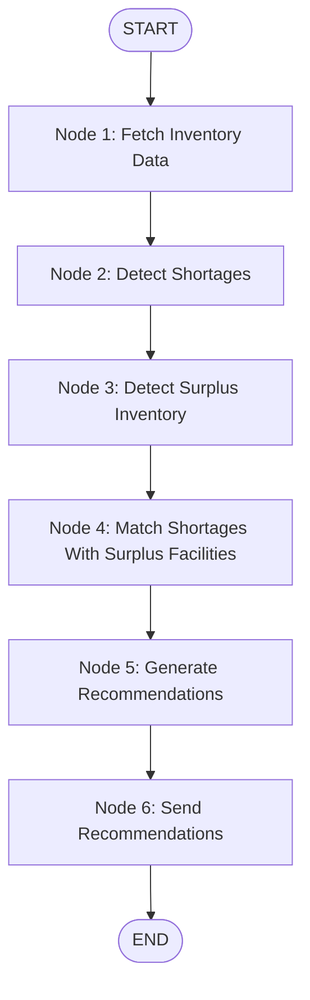

# LifeLink - Inventory Management AI Agent (Student 3)

The **Inventory Management AI Agent** is an isolated Python microservice for the **LifeLink Blood Donation System**. It operates independently from the ASP.NET Core backend to monitor blood inventory across hospitals and blood banks, detect shortages and surpluses, perform single-source matching (selecting the facility with the largest available surplus), generate human-readable transfer recommendations, and dispatch recommendations via HTTP backend APIs.

---

## 1. Architecture Overview

- **Framework**: Python 3.12+ & FastAPI
- **Workflow Engine**: LangGraph & LangChain Core
- **Data Validation**: Pydantic v2
- **HTTP Client**: HTTPX (Async)
- **ASGI Server**: Uvicorn

The service communicates strictly by consuming existing ASP.NET Core backend APIs via HTTP. It does not access the database directly, run migrations, or alter backend entity structures.

```
+-------------------------------------------------------------+
|               LifeLink ASP.NET Core Backend                 |
+------------------------------+------------------------------+
                               ^ | GET /api/inventory
     POST /api/notifications   | v
     /recommendations          |
+------------------------------+------------------------------+
|             Inventory Management AI Agent                   |
|   +-----------------------------------------------------+   |
|   |                  FastAPI Server                     |   |
|   +--------------------------+--------------------------+   |
|                              |                              |
|                              v                              |
|   +-----------------------------------------------------+   |
|   |                LangGraph Workflow                   |   |
|   |  Fetch -> Shortages -> Surpluses -> Match -> Send   |   |
|   +-----------------------------------------------------+   |
+-------------------------------------------------------------+
```

---

## 2. Project Folder Structure

```
Agents/InventoryManagement/
├── api/
│   ├── __init__.py
│   └── app.py                # FastAPI endpoints (/health, /run) & scheduler loop
├── graph/
│   ├── __init__.py
│   └── workflow.py           # LangGraph StateGraph nodes & compilation
├── services/
│   ├── __init__.py
│   ├── inventory_service.py  # Fetches inventory from backend API
│   ├── matching_service.py   # Detects shortages/surpluses & matches facilities
│   ├── recommendation_service.py # Formats dual/fallback recommendation messages
│   └── notification_service.py   # Sends recommendation HTTP requests
├── models/
│   ├── __init__.py
│   ├── state.py              # LangGraph InventoryState model
│   ├── inventory.py          # InventoryRecord, ShortageRecord, SurplusRecord
│   └── recommendation.py     # Recommendation model
├── config/
│   ├── __init__.py
│   ├── settings.py           # Pydantic BaseSettings & .env loader
│   └── constants.py          # Application constants & default values
├── .env.example              # Environment variables template
├── requirements.txt          # Python dependencies
└── README.md                 # Complete microservice documentation
```

---

## 3. LangGraph Workflow Diagram



---

## 4. Installation Steps

### Prerequisites
- **Python 3.12+**
- **pip**

### Step 1: Create Virtual Environment
```bash
cd Agents/InventoryManagement
python -m venv .venv
```

### Step 2: Activate Virtual Environment
- **Windows (PowerShell)**:
  ```powershell
  .\.venv\Scripts\Activate.ps1
  ```
- **Linux / macOS**:
  ```bash
  source .venv/bin/activate
  ```

### Step 3: Install Dependencies
```bash
pip install -r requirements.txt
```

---

## 5. Environment Setup

Copy `.env.example` to `.env` and configure your backend parameters:

```bash
cp .env.example .env
```

### `.env` File Parameters
```env
BACKEND_API_URL=http://localhost:5000
INVENTORY_ENDPOINT=/api/inventory
NOTIFICATION_ENDPOINT=/api/notifications/recommendations
REQUEST_TIMEOUT=30
SCHEDULE_INTERVAL_MINUTES=30
```

---

## 6. Run Commands

### Development Server
Run the FastAPI service using `uvicorn`:

```bash
uvicorn api.app:app --host 0.0.0.0 --port 8003 --reload
```

---

## 7. API Contracts & Usage

### 1. Health Check Endpoint
- **Method**: `GET`
- **Path**: `/health`
- **Response**:
```json
{
  "status": "healthy"
}
```

### 2. Run Workflow Endpoint
- **Method**: `POST`
- **Path**: `/run`
- **Description**: Triggers inventory analysis manually on demand.
- **Response**:
```json
{
  "shortages": [
    {
      "facilityId": "HOSP_001",
      "facilityName": "City Hospital",
      "facilityType": "Hospital",
      "bloodGroup": "O+",
      "shortageUnits": 15
    }
  ],
  "surpluses": [
    {
      "facilityId": "BB_002",
      "facilityName": "Central Blood Bank",
      "facilityType": "BloodBank",
      "bloodGroup": "O+",
      "surplusUnits": 30
    }
  ],
  "recommendations": [
    {
      "targetFacilityId": "HOSP_001",
      "targetFacilityName": "City Hospital",
      "targetFacilityType": "Hospital",
      "recommendationType": "RECIPIENT",
      "relatedFacilityId": "BB_002",
      "relatedFacilityName": "Central Blood Bank",
      "relatedFacilityType": "BloodBank",
      "bloodGroup": "O+",
      "requiredUnits": 15,
      "availableSurplus": 30,
      "recommendedTransferUnits": 15,
      "message": "Your Hospital inventory is below the minimum threshold for O+ blood.\n\nSuggested source: Central Blood Bank\nAvailable surplus: 30 units\nRecommended transfer: 15 units",
      "timestamp": "2026-09-17T17:30:00.000Z"
    },
    {
      "targetFacilityId": "BB_002",
      "targetFacilityName": "Central Blood Bank",
      "targetFacilityType": "BloodBank",
      "recommendationType": "SOURCE",
      "relatedFacilityId": "HOSP_001",
      "relatedFacilityName": "City Hospital",
      "relatedFacilityType": "Hospital",
      "bloodGroup": "O+",
      "requiredUnits": 15,
      "availableSurplus": 30,
      "recommendedTransferUnits": 15,
      "message": "City Hospital requires O+ blood.\nYour facility currently has surplus stock.\nSuggested transfer: 15 units.",
      "timestamp": "2026-09-17T17:30:00.000Z"
    }
  ]
}
```

---

## 8. Scheduled Automated Runs
The service automatically triggers the inventory analysis workflow every **30 minutes** (configurable via `SCHEDULE_INTERVAL_MINUTES` in `.env`).
