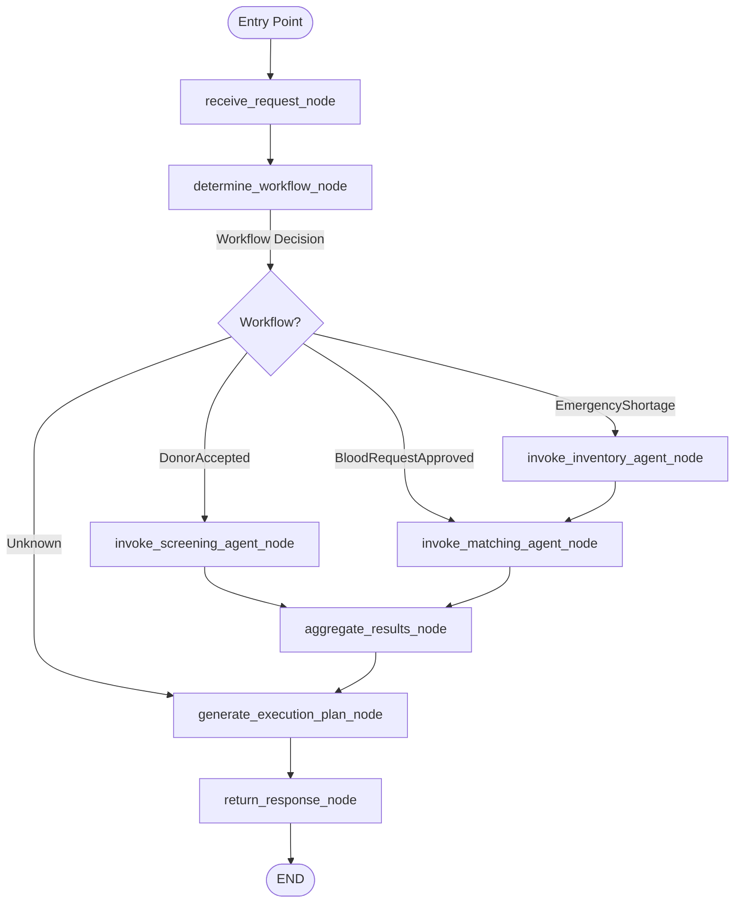

# LifeLink Planning Agent (AI Workflow Orchestrator)

The **LifeLink Planning Agent** is a dedicated, lightweight, and high-performance workflow orchestration microservice for the LifeLink platform. It acts as the single point of contact between the **ASP.NET Core Backend** and the three specialized AI microservices.

---

## Architectural Role & Boundary

```
                     ┌────────────────────────┐
                     │  ASP.NET Core Backend  │
                     └───────────┬────────────┘
                                 │ POST /plan
                                 ▼
                     ┌────────────────────────┐
                     │ LifeLink Planning Agent│
                     │  (LangGraph + FastAPI) │
                     └─────┬──────┬──────┬────┘
                           │      │      │
            ┌──────────────┘      │      └──────────────┐
            │                     │                     │
            ▼                     ▼                     ▼
┌───────────────────────┐ ┌────────────────┐ ┌──────────────────────┐
│ Agent 1 (Screening)   │ │Agent 2 (Match) │ │ Agent 3 (Inventory)  │
│ Port 8001             │ │Port 8000       │ │ Port 8003            │
│ Medical Questionnaires│ │Donor Discovery │ │ Shortages & Transfers│
└───────────────────────┘ └────────────────┘ └──────────────────────┘
```

> [!IMPORTANT]
> **Strict Separation of Responsibilities:**
> - The Planning Agent is **NOT** a medical screening agent (belongs to Agent 1).
> - The Planning Agent is **NOT** a donor matching agent (belongs to Agent 2).
> - The Planning Agent is **NOT** an inventory optimization agent (belongs to Agent 3).
> - The Planning Agent is **NOT** a governance decision agent (belongs to Student 4 backend).
> 
> Its sole duty is **deterministic execution sequencing, HTTP orchestration, fault tolerance, and response aggregation**.

---

## Supported Workflows

| Workflow | Trigger Event | Sequence | Orchestrated Action |
|---|---|---|---|
| **Workflow 1** | `BloodRequestApproved` | `Backend` $\to$ `Agent 2 (Matching)` | Matches and ranks compatible donors; synthesizes localized donor notification messages. |
| **Workflow 2** | `DonorAccepted` | `Backend` $\to$ `Agent 1 (Screening)` | Initializes donor medical questionnaire session and returns questionnaire step 1. |
| **Workflow 3** | `EmergencyShortage` | `Backend` $\to$ `Agent 3 (Inventory)` $\to$ `Agent 2 (Matching)` | Generates dual-action response: inter-hospital surplus transfer recommendations + emergency direct donor broadcast alerts. |

---

## LangGraph StateGraph Architecture

The workflow is driven by an 8-node LangGraph `StateGraph`:



---

## Directory Structure

```
Agents/
└── PlanningAgent/
    ├── api/
    │   ├── __init__.py
    │   └── routes.py                 # REST endpoints: POST /plan, GET /health, GET /
    ├── config/
    │   ├── __init__.py
    │   └── settings.py               # Pydantic Settings & environment configuration
    ├── graph/
    │   ├── __init__.py
    │   ├── state.py                  # LangGraph AgentState TypedDict
    │   ├── nodes.py                  # 8 LangGraph deterministic nodes
    │   └── workflow.py               # StateGraph compilation & deterministic edges
    ├── models/
    │   ├── __init__.py
    │   ├── request.py                # PlanRequest and EventType enum
    │   └── response.py               # PlanResponse, ExecutionPlan, ActionItem models
    ├── services/
    │   ├── __init__.py
    │   ├── agent_clients.py          # Resilient async HTTPX client for Agents 1-3
    │   └── planner_service.py        # Orchestration service wrapper
    ├── tests/
    │   ├── __init__.py
    │   ├── conftest.py               # Pytest fixtures and mock agent responses
    │   ├── test_workflows.py         # Complete workflow tests & failure resilience
    │   └── test_api.py               # API route integration tests
    ├── app.py                        # FastAPI application entrypoint
    ├── workflow.py                   # Root workflow export and standalone CLI runner
    ├── requirements.txt              # Production dependencies
    ├── .env.example                  # Environment configuration template
    └── README.md                     # Documentation
```

---

## API Specification

### 1. Orchestrate Workflow: `POST /plan`

**Request:**
```json
{
  "eventType": "BloodRequestApproved",
  "payload": {
    "requestId": "550e8400-e29b-41d4-a716-446655440000",
    "bloodGroup": "O+",
    "unitsRequired": 2,
    "priority": "URGENT",
    "hospitalId": "3fa85f64-5717-4562-b3fc-2c963f66afa6",
    "hospitalName": "City General Hospital"
  }
}
```

**Response (`200 OK`):**
```json
{
  "success": true,
  "workflow": "BloodRequestApproved",
  "agentsInvoked": ["MatchingAgent"],
  "executionPlan": {
    "summary": "Blood request approved. Agent 2 ranked 5 compatible donors and synthesized 5 notifications.",
    "workflowStatus": "COMPLETED",
    "actionItems": [
      {
        "agent": "MatchingAgent",
        "action": "DISPATCH_DONOR_NOTIFICATIONS",
        "status": "SUCCESS",
        "details": {
          "rankedDonorsCount": 5,
          "notificationsGenerated": 5
        }
      }
    ],
    "results": {
      "matching": { ... }
    }
  },
  "timestamp": "2026-09-18T12:00:00Z"
}
```

### 2. Health & Diagnostic Probe: `GET /health`

**Response (`200 OK`):**
```json
{
  "status": "Healthy",
  "service": "LifeLink Planning Agent (Workflow Orchestrator)",
  "version": "1.0.0",
  "timestamp": "2026-09-18T12:00:00Z",
  "downstreamAgents": {
    "Agent1_Screening": {
      "url": "http://localhost:8001/api/agent/health",
      "status": "REACHABLE",
      "latencyMs": 4.5,
      "error": null
    },
    "Agent2_Matching": {
      "url": "http://localhost:8000/health",
      "status": "REACHABLE",
      "latencyMs": 3.8,
      "error": null
    },
    "Agent3_Inventory": {
      "url": "http://localhost:8003/health",
      "status": "REACHABLE",
      "latencyMs": 5.1,
      "error": null
    }
  }
}
```

---

## Setup & Running

### 1. Install Dependencies
```bash
cd Agents/PlanningAgent
pip install -r requirements.txt
```

### 2. Configure Environment
```bash
cp .env.example .env
```

### 3. Run Microservice
```bash
uvicorn app:app --host 0.0.0.0 --port 8004 --reload
```
Interactive Swagger Documentation: `http://localhost:8004/docs`

### 4. Run Automated Tests
```bash
pytest -v tests
```
