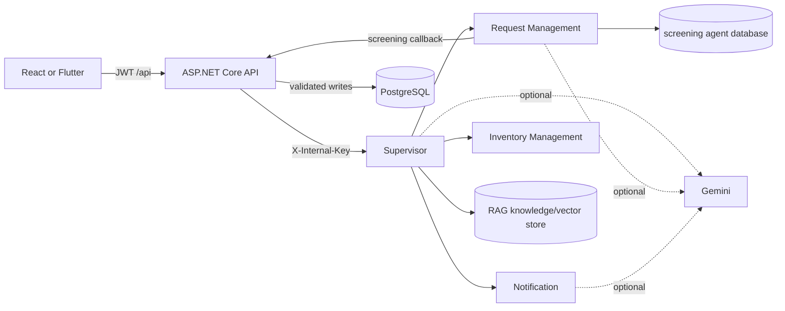

# LifeLink agents

The agent subsystem is internal to LifeLink. Clients call the ASP.NET Core API; the backend calls the Supervisor or a controlled fallback using `X-Internal-Key`. Agents do not make clinical or governance decisions and do not write the main PostgreSQL database.

## Topology and startup

| Service | Port | Responsibility | Detail |
|---|---:|---|---|
| Notification | 8000 | Deterministic recipient checks, optional Gemini ranking/text, alert composition | [README](Notification/README.md) |
| Request Management | 8001 | Donor interview, answer validation, versioned screening reports | [README](RequestManagement/README.md) |
| Inventory Management | 8003 | Shortage, expiry, emergency-source, and transfer recommendations | [README](InventoryManagement/README.md) |
| Supervisor | 8004 | Routes events/chat, runs planning and RAG, composes guarded responses | [README](Supervisor/README.md) |

Start the three workers before the Supervisor, then start the backend. Each service exposes `GET /health`; other endpoints require the shared internal key. Configuration values belong in ignored `.env` files or environment variables.

## Trust and data flow

The backend supplies role-scoped snapshots and backend-selected recipient candidates. The Supervisor does not query user data independently. Returned notifications are persisted only after backend validation.

## Supervisor contracts and event plans

- `POST /plan`: accepts an event type plus payload and returns a plan, invoked agents, trace/errors, actions, and composed notifications.
- `POST /chat`: accepts a user message, role-scoped snapshot, and optional screening context; returns labelled answer segments and safe navigation actions.

`EVENT_PLANS` currently contains:

| Event | Ordered steps |
|---|---|
| `BloodRequestApproved` | planning, notification |
| `DonorAccepted` | request_management |
| `EmergencyShortage` | planning, inventory, notification |
| `InventoryCheck` | inventory, planning, notification |

Unsupported events return a structured error and invoke no worker.

## Worker contracts and allow-listed calls

| Agent | Input/output | Allowed external interaction |
|---|---|---|
| Request Management | Acceptance id plus chat/structured answers; returns question/session/report state | Read the relevant acceptance and minimal user profile; update screening status; notify the backend of a completed report |
| Notification | Backend-filtered donors/hospitals plus request/recommendation facts; returns notification objects | No database writes; optional Gemini call using minimized data |
| Inventory Management | Inventory/public-request snapshot or emergency stock candidates; returns ranked recommendations | Primary `/analyze` path has no side effects; legacy scheduler may call only the configured inventory and recommendation endpoints when explicitly enabled |
| Supervisor | Event/chat envelope; returns composed, guarded result | Call the three configured worker URLs and its local RAG store |

## Deterministic rules versus LLM use

Deterministic code decides eligibility, compatibility, donation intervals, questionnaire flags, stock shortages, expiry, routing, recipient allow-lists, and safety checks. Gemini may interpret otherwise-unparsed screening prose, summarize a completed questionnaire, classify chat intent, rank already-eligible candidates, or improve wording. Confidential screening question 7 is rules-only and is never sent to an LLM. Missing keys, timeouts, invalid output, or provider errors fall back to rules/templates where supported.

## Persisted state

- The main business state and notifications live only in backend PostgreSQL.
- Request Management persists screening sessions, answers, and report copies in its configured database and uses Alembic migrations.
- The Supervisor reads Markdown RAG sources and may build its local vector store; it falls back to keyword retrieval.
- Supervisor plan traces are returned but are not stored as generic workflow history.
- Notification and the normal Inventory `/analyze` path are stateless.

## Human approval points

- Hospital staff verify a request and assign a doctor.
- A doctor approves or rejects a verified request.
- The screening agent flags and summarizes; a doctor decides donor suitability.
- A doctor or authorized hospital staff records an actual donation.
- The transfer counterpart approves/rejects transfers and selects packets where required.
- Administrators decide registration, suspension, appeal, and complaint actions.

## Example workflows

### Donor screening

1. The backend validates and saves the donor acceptance.
2. `DonorAccepted` reaches the Supervisor.
3. Request Management opens an interview and marks the acceptance `ScreeningPending` through the backend.
4. Each donor turn is relayed by the backend/Supervisor; deterministic parsing runs before optional Gemini interpretation.
5. Rules create flags and Gemini may prepare a summary; a versioned report is persisted by Request Management and submitted to the backend.
6. The backend marks screening complete. A doctor sees all answers and makes the decision.

### Critical request alerts

1. A doctor approves a Critical request.
2. The backend selects eligible exact-group donors and hospitals with suitable stock.
3. The Supervisor runs planning and Notification.
4. Notification rechecks deterministic candidate fields, optionally ranks/composes, and returns alerts.
5. The backend saves alerts only for its original recipients. Normal requests are silent; High alerts exact-group eligible donors only, while Critical may also alert qualifying hospitals above their own minimum threshold.

### Inventory analysis

1. The backend monitor or hospital manual action builds a stock snapshot.
2. `InventoryCheck` invokes Inventory analysis, planning, and Notification.
3. Inventory reports below-threshold groups and expiring packets, including possible sources/destinations.
4. Notification composes deduplicated hospital alerts; the backend persists them. No packet moves automatically.

### Emergency shortage

1. A hospital raises an emergency and the backend selects compatible stock holders.
2. `EmergencyShortage` invokes planning, Inventory ranking, and Notification.
3. Hospitals receive alerts and may create/approve a transfer. Human action is required to move packets.

## Safety and configuration

- Internal authentication: `INTERNAL_SERVICE_API_KEY` in agents and `InternalService__ApiKey` in the backend.
- Gemini names: `GEMINI_API_KEY` and/or `GOOGLE_API_KEY` as documented by each agent.
- Do not expose agent ports publicly or place secret values in documentation.
- Guardrails redact unapproved identifiers/contact details and rewrite claims that imply the AI made a human decision.
- Timeouts and worker errors are returned as structured errors; the backend retains authority over whether an operation continues.

