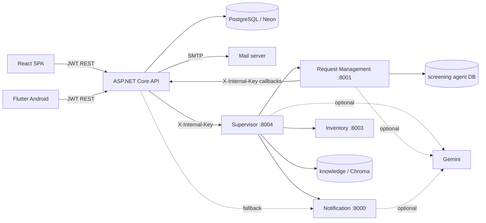
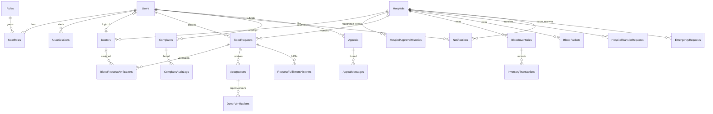

# LifeLink technical documentation

This is the canonical technical document for the current repository. Component READMEs cover setup; this document covers architecture, contracts, rules, data, and workflows. Historical evidence remains in [report-facts.md](report-facts.md).

## Project overview

LifeLink connects Sri Lankan donors/patients, hospitals, doctors, and an administrator. It coordinates verified blood requests, donor screening, packet-level inventory, transfers, emergencies, and governance. The ASP.NET Core API is the only public server and the PostgreSQL database is the system of record. AI supports interviews, summaries, routing, and alert wording; humans approve requests, donors, transfers, and governance actions.

### Roles and permissions

| Capability | User | HospitalStaff | Doctor | Admin |
|---|---:|---:|---:|---:|
| Self-register/login/profile | Yes | Hospital registration | Hospital-created account | Existing/ownership transfer |
| Create blood request | Yes | Yes, own hospital | No | Yes |
| Verify request/assign doctor | No | Own hospital | No | Oversight only |
| Approve verified request | No | No | Assigned doctor | No |
| Accept request as donor | Yes | No | No | No |
| Offer hospital packets | No | Yes | Review only | No |
| Decide screening/record donation | No | Authorized actions | Yes | No |
| Manage inventory/transfers/emergencies | No | Own hospital | No | Read/suspend oversight |
| Complaints/appeals | Own threads | Hospital threads | Read hospital governance | Review/decide |
| Manage accounts/hospitals | No | Own doctors/profile | Own profile | Yes |

`InternalAgent` is a service principal created only by internal-key middleware; it is not an interactive role.

## System architecture

React and Flutter call the API only. The backend validates identity, recipient scope, business state, and every database write. Agents use `X-Internal-Key`, receive minimized snapshots, and return results for backend validation. MailKit sends configured SMTP mail for password and governance events.

## Backend

### Structure and layers

| Path | Responsibility |
|---|---|
| `Controllers/` | HTTP routes, role attributes, caller/hospital scoping |
| `DTOs/` | Request/response contracts and annotation validation |
| `Services/` | Business rules and workflow coordination |
| `Services/Inventory/InventoryLedger.cs` | Authoritative packet/count/transaction changes |
| `Data/AppDbcontext.cs` | EF mappings, constraints, indexes, concurrency, immutable reports/logs |
| `Entities/` | Persistent model and status values |
| `Middleware/` | Exception mapping, internal service identity, governance restrictions |
| `Common/` | Blood/attachment validation, conflicts, idempotency |

The request pipeline applies global exception handling, CORS, internal-service authentication, JWT authentication/authorization, restricted-governance mode, and rate limiting. Pending migrations are applied during startup.

### Authentication and sessions

- JWTs are HMAC-SHA256 signed and validated for issuer, audience, key, lifetime, account state, current Admin ownership, and server-side session.
- Each login creates `UserSessions`; `sid` is placed in the token. Logout or inactivity ends the session.
- `X-LifeLink-Activity: 1` records user activity. Background polling omits it. The configured warning precedes the idle timeout.
- `X-Session-Ended` distinguishes idle and explicit/other ended sessions.
- Suspended accounts are restricted to permitted auth heartbeat/logout, governance status, and appeal routes. A suspended plain donor may also use the governance page's narrow exception to view and withdraw only their own active donation participation. Doctors of a suspended hospital have read-only governance access.
- Internal middleware converts a valid `X-Internal-Key` into an `InternalAgent` principal.

### API endpoints

Routes are case-insensitive in ASP.NET Core. “Signed in” means any authenticated interactive role unless a narrower role is shown.

#### Authentication, profiles, governance, and search

| Method | Route | Roles | Purpose |
|---|---|---|---|
| POST | `/api/Auth/register` | Anonymous | Register a donor/patient account |
| POST | `/api/Auth/login` | Anonymous | Authenticate and start a server session |
| POST | `/api/Auth/logout` | Anonymous/token if present | End the current session |
| POST | `/api/Auth/activity` | Signed in | Record explicit user activity |
| GET | `/api/Auth/me` | Signed in | Current user/session profile |
| DELETE | `/api/Auth/me` | User | Delete own donor/patient account while retaining redacted history |
| GET | `/api/Auth/user/{id}` | InternalAgent, Admin, HospitalStaff | Minimal screening user profile |
| POST | `/api/Auth/forgot-password` | Anonymous | Send password-reset OTP without account enumeration |
| POST | `/api/Auth/verify-otp` | Anonymous | Verify OTP and issue reset-session token |
| POST | `/api/Auth/resend-otp` | Anonymous | Replace/resend OTP |
| POST | `/api/Auth/reset-password` | Anonymous | Use verified reset session to set password |
| POST | `/api/Auth/change-password` | Signed in | Change current password/clear doctor first-login flag |
| GET | `/api/profiles/hospital/{id}` | Anonymous | Public hospital profile |
| GET | `/api/profiles/user/{id}` | Signed in | Authorized user profile |
| GET | `/api/profiles/doctor/{id}` | Signed in | Authorized doctor profile |
| GET | `/api/profiles/me` | Signed in | Role-specific own profile |
| PUT | `/api/profiles/user/{id}` | User, Admin | Update authorized user profile |
| PUT | `/api/profiles/doctor/{id}` | Doctor | Update own doctor profile |
| PUT | `/api/profiles/hospital/{id}` | HospitalStaff | Update own hospital profile |
| GET | `/api/governance/status` | Signed in | Suspension state, allowed actions, appeal threads |
| POST | `/api/Appeals` | Signed in | Open a suspension appeal |
| POST | `/api/Appeals/{id}/reply` | Signed in | Appellant thread reply |
| GET | `/api/Appeals/my` | Signed in | Caller’s appeal history |
| GET | `/api/activity-logs/my` | Signed in | Paged/filterable own or own-hospital activity |
| GET | `/api/search` | Signed in | Role-scoped search |
| POST | `/api/assistant/chat` | User, HospitalStaff, Doctor, Admin | Role-scoped assistant or screening turn |

#### Hospitals and doctors

| Method | Route | Roles | Purpose |
|---|---|---|---|
| POST | `/api/Hospitals` | Anonymous | Register hospital and staff login |
| GET | `/api/Hospitals` | Signed in | List visible hospitals |
| GET | `/api/Hospitals/me` | HospitalStaff | Own hospital |
| GET | `/api/Hospitals/{id}` | Signed in | Hospital detail |
| PUT | `/api/Hospitals/{id}/verify` | Admin | Legacy alias for approval |
| PUT | `/api/Hospitals/{id}/approve` | Admin | Approve registration |
| POST | `/api/Hospitals/{id}/replies` | HospitalStaff | Reply in rejected registration conversation |
| POST | `/api/Doctors` | HospitalStaff | Create doctor for own hospital |
| GET | `/api/Doctors` | HospitalStaff, Admin | List authorized doctors |
| GET | `/api/Doctors/{id}` | HospitalStaff, Admin, Doctor | Doctor detail |
| DELETE | `/api/Doctors/{id}` | HospitalStaff | Soft-remove own hospital doctor |

#### Blood requests, verification, acceptance, and matching

| Method | Route | Roles | Purpose |
|---|---|---|---|
| POST | `/api/BloodRequests` | User, HospitalStaff, Admin | Create request |
| PUT | `/api/BloodRequests/{id}` | User | Creator edits pending group/units |
| GET | `/api/BloodRequests/my` | Signed in | Requests created by caller |
| GET | `/api/BloodRequests/hospital` | HospitalStaff | Requests for own hospital |
| GET | `/api/BloodRequests/assigned` | Doctor | Assigned doctor queue |
| DELETE | `/api/BloodRequests/{id}` | Signed-in creator | Soft-delete own request and close dependants |
| GET | `/api/BloodRequests/public` | Anonymous | Active approved public requests |
| GET | `/api/BloodRequests/pending` | HospitalStaff, Admin | Pending verification queue |
| GET | `/api/BloodRequests/{id}` | Signed in | Authorized request detail |
| PUT | `/api/BloodRequests/{id}/cancel` | Signed-in creator | Cancel request |
| GET | `/api/BloodRequests/{id}/acceptances` | Doctor, HospitalStaff, Admin | Donors/hospital offers for request |
| PUT | `/api/BloodRequests/{id}/finalize-selection` | Doctor, HospitalStaff | Record selected donations and tested groups |
| GET | `/api/BloodRequests/{id}/analytics` | Signed in | Authorized request analytics |
| GET | `/api/BloodRequests/{id}/fulfillment-history` | Signed in | Donation/fulfillment history |
| PUT | `/api/requests/{id}/verify` | HospitalStaff | Assign active doctor and verify |
| PUT | `/api/requests/{id}/approve` | Doctor | Assigned doctor approves request |
| PUT | `/api/requests/{id}/reject` | HospitalStaff, Doctor | Reject with reason in permitted state |
| GET | `/api/requests/verifications` | Admin | Verification audit list |
| POST | `/api/Acceptances` | User | Accept approved request and trigger screening |
| POST | `/api/Acceptances/hospital` | HospitalStaff | Offer selected packets to another hospital’s request |
| PUT | `/api/Acceptances/{id}/hospital-approve` | Doctor | Approve hospital donation |
| PUT | `/api/Acceptances/{id}/hospital-reject` | Doctor | Reject hospital donation and release packets |
| GET | `/api/Acceptances/my` | Signed in | Caller/hospital acceptance history |
| GET | `/api/Acceptances/{id}` | Signed in | Authorized acceptance detail |
| PUT | `/api/Acceptances/{id}/cancel` | Signed-in owner | Withdraw donor/hospital acceptance |
| GET | `/api/Acceptances/{id}/screening-answers` | User owner | Latest answers and edit permission |
| PUT | `/api/Acceptances/{id}/screening-answers` | User owner | Validate and submit revised answer version |
| PUT | `/api/Acceptances/{id}/status` | Signed in/internal workflow | Controlled screening status transition |
| PUT | `/api/Acceptances/{id}/release` | Doctor, HospitalStaff | Release reserved donor with reason |
| PUT | `/api/donor-verification/{id}/approve` | Doctor | Approve latest pending screening report/reserve slot |
| PUT | `/api/donor-verification/{id}/reject` | Doctor | Reject latest pending screening report |
| GET | `/api/donor-verification` | Doctor, Admin | Screening reports/versions visible to role |
| POST | `/api/matching/create` | Doctor, Admin | Create donor-patient match |
| GET | `/api/matching` | Doctor, Admin, InternalAgent | List matches |
| GET | `/api/matching/{id}` | Doctor, Admin, InternalAgent | Match detail |
| POST | `/api/agent/screening/report-notify` | InternalAgent | Idempotently submit versioned screening report |

#### Inventory, transfers, emergencies, and notifications

| Method | Route | Roles | Purpose |
|---|---|---|---|
| POST | `/api/Inventory` | HospitalStaff | Add inventory blood-group category |
| GET | `/api/Inventory` | HospitalStaff, Admin, InternalAgent | Role-scoped inventory list/snapshot |
| POST | `/api/Inventory/analysis/run` | HospitalStaff | Run manual inventory analysis |
| GET | `/api/Inventory/analysis/status` | HospitalStaff | Latest/running analysis state |
| GET | `/api/Inventory/low-stock` | HospitalStaff, Admin, InternalAgent | Below-threshold stock |
| GET | `/api/Inventory/surplus` | HospitalStaff, Admin, InternalAgent | Above-threshold stock candidates |
| GET | `/api/Inventory/{id}` | HospitalStaff, Admin, InternalAgent | Inventory group detail |
| GET | `/api/Inventory/{id}/transactions` | HospitalStaff, Admin, InternalAgent | Packet ledger history |
| PUT | `/api/Inventory/{id}` | HospitalStaff | Update own thresholds/capacity |
| DELETE | `/api/Inventory/{id}` | HospitalStaff | Soft-delete unused own group |
| GET | `/api/Inventory/packets` | HospitalStaff, Admin, InternalAgent | Filtered packet list |
| POST | `/api/Inventory/packets` | HospitalStaff | Create collected packets; idempotent |
| PUT | `/api/Inventory/packets/{packetId}` | HospitalStaff | Edit eligible creator-held packet |
| GET | `/api/Inventory/hospital/{hospitalId}` | HospitalStaff, Admin, InternalAgent | Hospital inventory snapshot |
| POST | `/api/transfers` | HospitalStaff | Create request/offer; idempotent |
| GET | `/api/transfers` | HospitalStaff, Admin | Role-scoped/all transfers |
| GET | `/api/transfers/pending` | HospitalStaff, Admin | Pending transfers |
| GET | `/api/transfers/{id}` | HospitalStaff, Admin | Transfer detail |
| PUT | `/api/transfers/{id}/approve` | HospitalStaff | Counterparty accepts/selects packets |
| PUT | `/api/transfers/{id}/reject` | HospitalStaff | Counterparty rejects with reason |
| DELETE | `/api/transfers/{id}` | HospitalStaff | Initiator withdraws pending transfer |
| POST | `/api/emergencyrequests` | HospitalStaff | Raise emergency; idempotent |
| GET | `/api/emergencyrequests` | HospitalStaff, Admin | Emergency list |
| GET | `/api/emergencyrequests/critical` | HospitalStaff, Admin | Critical emergencies |
| GET | `/api/emergencyrequests/{id}` | HospitalStaff, Admin | Emergency detail |
| PUT | `/api/emergencyrequests/{id}/approve` | HospitalStaff | Approve permitted emergency |
| PUT | `/api/emergencyrequests/{id}/reject` | HospitalStaff | Reject emergency |
| PUT | `/api/emergencyrequests/{id}/complete` | HospitalStaff | Mark complete; does not itself move stock |
| GET | `/api/notifications` | Admin | All notifications |
| GET | `/api/notifications/my` | Signed in | Own/user-or-hospital notifications |
| GET | `/api/notifications/unread-count` | Signed in | Own unread count |
| PATCH | `/api/notifications/{id}/read` | Signed in | Mark owned notification read |
| DELETE | `/api/notifications/{id}` | Signed in | Soft-dismiss owned notification |
| PATCH | `/api/notifications/read-all` | Signed in | Mark all owned notifications read |
| GET | `/api/notifications/user/{userId}` | Signed in, scope checked | Authorized user notifications |
| POST | `/api/notifications/recommendations` | Admin, InternalAgent | Persist validated recommendation alerts |

#### Complaints, activity reports, and administration

| Method | Route | Roles | Purpose |
|---|---|---|---|
| POST | `/api/Complaints` | User, HospitalStaff | File complaint/general question; idempotent |
| POST | `/api/Complaints/{id}/reply` | User, HospitalStaff | Creator reply with optional attachment |
| GET | `/api/Complaints` and `/api/Complaints/my-complaints` | User, HospitalStaff | Own complaints |
| PUT | `/api/Complaints/{id}/solve` | User, HospitalStaff | Creator resolves thread |
| PUT | `/api/Complaints/{id}/cancel` | User, HospitalStaff | Creator soft-deletes/cancels |
| POST | `/api/hospital/activity-reports` | HospitalStaff | Submit requested hospital report |
| GET | `/api/Admin/dashboard` | Admin | Dashboard statistics |
| GET | `/api/Admin/hospitals/pending` | Admin | Pending registration queue |
| PUT | `/api/Admin/hospitals/{id}/approve` | Admin | Approve registration |
| PUT | `/api/Admin/hospitals/{id}/reject` | Admin | Reject registration with reason |
| POST | `/api/Admin/hospitals/{id}/comments` | Admin | Registration conversation comment |
| PUT | `/api/Admin/users/{id}/suspend` | Admin | Suspend donor/patient |
| PUT | `/api/Admin/users/{id}/reinstate` | Admin | Reinstate and approve open appeal |
| PUT | `/api/Admin/users/{id}/block` | Admin | Permanently block donor/patient |
| PUT | `/api/Admin/users/{id}/promote` | Admin | Transfer single Admin ownership |
| PUT | `/api/Admin/hospitals/{id}/suspend` | Admin | Suspend approved hospital |
| PUT | `/api/Admin/hospitals/{id}/reinstate` | Admin | Reinstate and approve open appeal |
| GET | `/api/Admin/users` | Admin | User directory |
| GET | `/api/Admin/hospitals` | Admin | Hospital directory/registrations |
| GET | `/api/Admin/complaints` | Admin | Complaint queue |
| GET | `/api/Admin/complaints/{id}` | Admin | Complaint/thread detail |
| PUT | `/api/Admin/complaints/{id}/review` | Admin | Admin reply/review |
| GET | `/api/Admin/activity-reports` | Admin | Hospital activity reports |
| GET | `/api/Admin/activity-reports/{id}` | Admin | Activity report detail |
| GET | `/api/Admin/appeals` | Admin | Appeal queue/filter |
| PUT | `/api/Admin/appeals/{id}/approve` | Admin | Approve and reinstate |
| PUT | `/api/Admin/appeals/{id}/reject` | Admin | Reject once while thread remains open |
| PUT | `/api/Admin/appeals/{id}/reply` | Admin | Admin appeal message |
| PUT | `/api/Admin/appeals/{id}/close` | Admin | Close thread without reinstatement |
| PUT | `/api/Admin/appeals/{id}/permanently-block` | Admin | Block user and close appeal |
| PUT | `/api/Admin/blood-requests/{id}/suspend` | Admin | Suspend open request with reason |
| PUT | `/api/Admin/blood-requests/{id}/lift` | Admin | Lift request suspension |
| PUT | `/api/Admin/transfers/{id}/suspend` | Admin | Suspend pending transfer |
| PUT | `/api/Admin/transfers/{id}/lift` | Admin | Lift transfer suspension |
| POST | `/api/Admin/messages` | Admin | One-way message to one user or hospital |
| GET | `/api/Admin/users/{id}/activity-log` | Admin | Paged user activity |
| GET | `/api/Admin/hospitals/{id}/activity-log` | Admin | Paged hospital activity |
| GET | `/api/Admin/blood-requests` | Admin | All requests including deleted |
| GET | `/api/Admin/attention-counts` | Admin | Registration/appeal/complaint/unseen counts |
| PUT | `/api/Admin/attention/{area}/seen` | Admin | Mark request/transfer area seen |

### Validation and business invariants

ASP.NET automatically returns 400 for invalid annotated DTOs. Services then enforce identity and state; PostgreSQL enforces final uniqueness/check/concurrency invariants.

| Area | Rules |
|---|---|
| Identity | Required valid email; PBKDF2 password hashing; strong password rules; normalized unique email; JWT/session/account state required |
| Blood | One of A+, A-, B+, B-, AB+, AB-, O+, O-; normalized before storage |
| Requests | Units 1–10; Normal/High/Critical; verified non-suspended destination; one active creator/hospital/group request; no automatic time-based expiry; only creator edits pending group/units |
| Donors | Active/unblocked/unsuspended User; compatible group; age 18–60 when DOB known; at least 120 days since last donation; one active donation process |
| Screening | Only newest pending version can be decided; reports/answers are versioned and immutable; rejection/release reasons required; approval requires a free slot |
| Doctors | Own-hospital active doctor; first-login password must be changed before new assignment/fallback; email unique among non-removed doctors; SLMC unique per hospital |
| Hospitals | Registration number normalized and unique; only approved hospitals can operate/be suspended; packet shelf life 21–35 days; expiry alert window 1–20 days |
| Packets | Collection date required/not future/not already expired; tracking/creator/created date immutable; only creator edits while it still owns an Available packet; stock count equals Available packets |
| Transfers | Different approved, non-suspended hospitals; units positive; only counterpart decides; selected packets exact-group, Available, unexpired, and not double-used |
| Governance | Suspension/admin-message/rejection text length bounds in DTO/service rules; one open appeal per user/hospital; appeal rejected at most once; exactly one Admin |
| Attachments | Data URL with allowed PDF/DOC/DOCX/PNG/JPG media, filename, and 2 MB limit |
| Idempotency | `Idempotency-Key` protects packet, transfer, emergency, and complaint creates; same user/key/endpoint cannot create twice |

Important database constraints/indexes include unique user/doctor email, hospital registration number, packet tracking number, hospital+blood group inventory, acceptance+report version, filtered doctor hospital+SLMC, single Admin, one active request per creator/hospital/group, and one open appeal per account/hospital. Request unit counters have non-negative/range checks.

### Errors, concurrency, and background work

`GlobalExceptionMiddleware` returns consistent responses. Validation/state failures are normally 400, missing records 404, scope failures 403, authentication failures 401, transient agent dependency failures 503, and concurrent/duplicate/idempotent conflicts 409.

`IConcurrencyVersioned` entities use advancing tokens; packets/inventory have equivalent protection. Adding acceptance, registration, complaint, or appeal child rows bumps the relevant parent. Unique/foreign-key conflicts are mapped to 409. Multi-row actions use EF transactions. The frontend/mobile disable repeated actions and reload after 409.

`RequestExpiryBackgroundService` retains the shared scheduled host for packet expiry, idempotency cleanup, and inventory monitoring. Its legacy blood-request expiry step is a no-op because blood requests no longer expire with time. A PostgreSQL-backed `BackgroundJobLeases` lease prevents duplicate sweeps across API instances.

## Database

Main table groups:

- Identity: `Users`, `Roles`, `UserRoles`, `UserSessions`, `PasswordResetTokens`.
- Hospitals: `Hospitals`, `Doctors`, `HospitalApprovalHistories`.
- Requests: `BloodRequests`, `BloodRequestVerifications`, `Acceptances`, `DonorVerifications`, `RequestFulfillmentHistories`, `DonorPatientMatches`.
- Inventory: `BloodInventories`, `BloodPackets`, `InventoryTransactions`, `HospitalTransferRequests`, `EmergencyRequests`, `InventoryAnalysisRuns`.
- Governance/communication: `Notifications`, `Complaints`, `ComplaintAuditLogs`, `HospitalActivityReports`, `Appeals`, `AppealMessages`, `ActivityLogs`, `AdminSeenMarkers`.
- Infrastructure: `IdempotencyKeys`, `BackgroundJobLeases`, and the packet tracking sequence.

Some domain references are intentionally plain IDs linked in service code. `Acceptances.BloodRequestId` is a restrictive foreign key. Activity logs are append-only. Screening report versions cannot be changed or deleted. Requests, complaints, doctors, unused inventory groups, and notifications use domain-specific soft deletion/dismissal so audit history remains.

### Migrations

Applied in filename order:

1. `20260908143225_InitialAuthFoundationMigration`
2. `20260908185713_AddStudent3Entities`
3. `20260910094405_AddStudent2Entities`
4. `20260911075152_AddStudent1Entities`
5. `20260911082219_AddStudent1Enhancements`
6. `20260918054655_AddStudent4AdminGovernanceEntities`
7. `20260922132320_AddOtpToPasswordResetTokens`
8. `20260922201758_AddIsPermanentlyBlocked`
9. `20260922204759_AddHospitalRegistrationQueueEnhancements`
10. `20260923102839_AddDoctorMustChangePassword`
11. `20260923191313_AddDoctorMustChangePasswordColumn`
12. `20260923201048_LifecycleScopeUpdate`
13. `20260923232154_AddDoctorSlmcUniqueIndex`
14. `20260923233921_HospitalRegistrationNumberUnique`
15. `20260924001715_AddComplaintReplyAttachment`
16. `20260924083356_GovernanceAppealThreadsSingleAdmin`
17. `20260924213026_AgenticExpansionPacketsAndReservations`
18. `20260925180000_RegistrationConversationData`
19. `20260925210000_RegistrationAwaitingAdminReview`
20. `20260927194934_HospitalPacketsAndDonations`
21. `20260927222159_AcceptanceBloodRequestForeignKey`
22. `20260927225230_AppealConcurrencyToken`
23. `20260928080218_RaceConditionSafety`
24. `20260928080242_UserSessions`
25. `20260928194442_BackgroundJobLeases`
26. `20261003114646_SoftDeleteAndAppealReject`
27. `20261003135936_BackfillAppealRejectedAt`
28. `20261003142423_ActivityLogsAndAdminSeen`
29. `20261003154916_AdminSuspensionOfRequestsAndTransfers`
30. `20261003162305_InventoryAnalysisAndDedupe`

## Business workflows

### Blood request, screening, and donation

1. A User/Admin creates a Pending request; a hospital-created request starts Verified with its own active doctor.
2. Hospital staff verify a Pending request and assign a doctor, or reject it.
3. The assigned doctor approves/rejects. Approved requests become public. Only Critical approval broadcasts alerts.
4. An eligible donor accepts. The backend commits before dispatching `DonorAccepted`.
5. Request Management interviews the donor, persists answers, and submits an immutable versioned report.
6. A doctor reviews every answer/flag and approves or rejects. Approval reserves one free unit slot.
7. A doctor/hospital staff records the actual donation with the tested group; only then do fulfilled units rise. Own-hospital requests create a packet.
8. Releasing/withdrawing an approved donor frees the reservation. The request completes when fulfilled units reach required units.

Creators may soft-delete requests in any status; active acceptances close, reservations/held packets release, reports remain, and currently affected participants are notified. Matched donations and fulfilled units remain historical. Blood requests do not expire automatically and remain governed by explicit workflow status changes.

### Inventory, packets, transfers, emergencies, and analysis

- Hospitals add individual 440 ml packets; available stock is derived from packet status. Every create/edit/reserve/release/issue/donate/transfer/expire operation writes ledger history.
- Exact packets are selected for issue, offers, transfer acceptance, and hospital donation. The ledger prevents double use.
- Transfer `Request`: receiver asks; sender selects packets when approving. Transfer `Offer`: sender reserves packets; receiver approves. Ownership and both audit sides update atomically.
- Emergencies notify compatible-stock hospitals but do not move stock. Hospitals respond operationally through transfers; donor help uses a Critical blood request.
- Scheduled/manual inventory analysis finds below-threshold groups and expiring packets. The agent recommends sources/destinations; deduped notifications are saved by the backend. No recommendation changes inventory automatically.

### Governance and communication

- Hospital registration is Pending → Approved or Rejected. Rejection opens a conversation; a hospital reply becomes AwaitingAdminReview.
- Admin may suspend/reinstate approved hospitals or donor/patient accounts. Suspended principals enter restricted governance mode.
- One open appeal thread is allowed per account/hospital. Approval/reinstatement resolves it; rejection is allowed once but keeps the thread open; close leaves suspension unchanged; permanent block applies only to users.
- Users/hospitals file complaints or general questions. Replies alternate with the Admin; optional attachments follow shared rules. Creator cancellation is soft deletion.
- Admin messages are one-way to exactly one donor/patient or one hospital. Activity logs are append-only and Admin attention markers track unseen request/transfer activity separately.

### Alert rules

- Normal requests rely on the public list. High approval proactively alerts eligible exact-group donors only. Critical approval alerts those donors plus other verified, active hospitals whose valid exact-group stock is strictly above their configured minimum threshold.
- Donor candidates must be backend-selected, active, eligible, and have the exact saved request group for alerts.
- Emergency hospital alerts use compatible available unexpired stock as selected by the backend.
- Inventory alerts cover shortage and expiring packets, are capped/deduplicated, and never authorize a stock movement.

## Frontend

`frontend/src/App.jsx` defines public auth/registration routes and protected donor, hospital, doctor, admin, governance, and profile routes. `ProtectedRoute` enforces authentication, suspension, hospital approval, doctor first-password change, and allowed roles. Role sidebars expose the corresponding dashboards and operational pages.

Key pages include donor requests/acceptances/screening/complaints; hospital inventory, emergencies, verification, transfers, donations, and doctors; doctor assigned requests and screening reports; Admin dashboard, registrations, complaints, appeals, and activity oversight; shared profiles and governance.

`AuthContext` is the main identity state. Notification/toast, theme, and admin-attention contexts provide cross-page UI state. Axios attaches the JWT, `X-LifeLink-Activity`, and per-form `Idempotency-Key`. Background polling is marked so it does not extend sessions. A 409 is shown and affected data is reloaded.

## Agents

See [Agents/README.md](../Agents/README.md) for contracts, allow-listed calls, deterministic/LLM boundaries, persisted state, event plans, fallbacks, and human approvals. The backend remains the only writer of core data.

## Mobile application

Flutter uses Riverpod repositories/controllers, `go_router` guards and role shells, Dio interceptors, and secure token storage. Steps 1, 3, and 4 are done. Step 2 is **in progress** and its donor/patient destinations currently render explicit stub screens. Implemented device integrations include packet QR scan/display, camera/file attachments, dial/email launchers, local notifications, and WorkManager polling. See [mobile/README.md](../mobile/README.md).

## Testing and CI

| Area | Command | Coverage/source |
|---|---|---|
| Backend | `dotnet test backend.Tests/backend.Tests.csproj` | xUnit service/workflow/race tests; optional PostgreSQL race suite via `LIFELINK_PG_TESTS` |
| Supervisor | `python -m pytest` in `Agents/Supervisor` | routing, events, chat, knowledge |
| Request Management | `python -m pytest` in its folder | interview, questionnaire, rules |
| Notification | `python -m pytest` in its folder | eligibility, composition/fallback |
| Inventory | `python -m pytest` in its folder | analysis/recommendations |
| Flutter | `flutter analyze`, `flutter test` | unit, widget, navigation, mocked HTTP integration |
| Frontend | `npm run lint`, `npm run build` | No automated React test suite currently |

`.github/workflows/backend-ci.yml` runs backend CI. `.github/workflows/flutter-ci.yml` runs Flutter analysis/tests for relevant changes. There is no current frontend or agent CI workflow.

## Deployment and startup

The intended deployment is React on Vercel, API on Render, and PostgreSQL on Neon. `frontend/vercel.json` contains SPA routing support. Live URLs and production hosting for the four Python services are **TO CONFIRM**. Agent ports must not be exposed as public client APIs.

Startup order: database → three worker agents → Supervisor → backend → web/mobile client. The backend applies migrations on startup, so deployment identity must have appropriate schema privileges.

### Configuration names only

| Component | Names |
|---|---|
| Backend | `ConnectionStrings__DefaultConnection`, `Jwt__Key`, `Jwt__Issuer`, `Jwt__Audience`, `Jwt__ExpiryMinutes`, `Session__IdleTimeoutMinutes`, `Session__WarningMinutes`, `InternalService__ApiKey`, `PlanningAgent__BaseUrl`, `NotificationAgent__BaseUrl`, `ScreeningAgent__BaseUrl`, `InventoryMonitoring__Enabled`, `InventoryMonitoring__IntervalMinutes`, `Smtp__Host`, `Smtp__Port`, `Smtp__Username`, `Smtp__Password`, `Smtp__FromName`, `Smtp__FromEmail`, `Swagger__Enabled` |
| Frontend | `VITE_API_BASE_URL` |
| Mobile | `API_BASE_URL` (`--dart-define`) |
| Supervisor | `HOST`, `PORT`, `LOG_LEVEL`, `INTERNAL_SERVICE_API_KEY`, `AGENT1_SCREENING_URL`, `AGENT2_MATCHING_URL`, `AGENT3_INVENTORY_URL`, `HTTP_TIMEOUT_SECONDS`, `GOOGLE_API_KEY`, `MODEL_NAME`, `EMBEDDING_MODEL`, `RETRIEVAL_MAX_DISTANCE` |
| Request Management | `HOST`, `PORT`, `ENVIRONMENT`, `DATABASE_URL`, `GEMINI_API_KEY`, `MODEL_NAME`, `BACKEND_BASE_URL`, `INTERNAL_SERVICE_API_KEY` |
| Notification | `HOST`, `PORT`, `GOOGLE_API_KEY`, `MODEL_NAME`, `INTERNAL_SERVICE_API_KEY` |
| Inventory | `INTERNAL_SERVICE_API_KEY`, `SCHEDULER_ENABLED`, `SCHEDULE_INTERVAL_MINUTES`, `BACKEND_API_URL`, `INVENTORY_ENDPOINT`, `NOTIFICATION_ENDPOINT`, `REQUEST_TIMEOUT` |

## Design decisions

The following D1–D19 decisions are preserved from the approved phase plan with the same numbering.

| # | Decision |
|---|---|
| D1 | The suspension guard only checks the flag; it does not mark the request as changed. A suspend therefore beats a racing action only when that action also changes the request row. A report submission that adds a row without changing the request can still slip in at the exact same moment. |
| D2 | The suspension reason is shown to everyone notified and on the “Suspended by admin” badge tooltip. |
| D3 | A hospital donating blood may withdraw while suspended, like a donor. |
| D4 | Hospital staff accounts are refused as user recipients of an admin message; the message goes through the hospital profile. |
| D5 | Lifting the suspension of a request deleted while suspended sends no notifications; it is only logged. |
| D6 | The planner cap is three alerts per hospital per run, ordered own shortage, help requests, then expiring packets. |
| D7 | A low-stock hospital alert lists at most five holder hospitals, largest stock first; each holder may still receive its own help alert. |
| D8 | The Surplus inventory badge remains a display badge, not a surplus alert. |
| D9 | During the phase test backend, scheduled inventory runs were disabled and scheduled panel states were checked with mocked status to avoid alerting real hospitals. |
| D10 | A doctor assigned before the first-login restriction keeps the old assignment; only new assignments are refused while `MustChangePassword` is true. |
| D11 | Approval alerts: Normal sends none; High alerts eligible exact-group donors; Critical alerts the same donors plus qualifying other hospitals with valid exact-group stock above their own minimum threshold. |
| D12 | Screening answer editing calls Request Management directly from the backend using `ScreeningAgent__BaseUrl`, because validation must succeed before superseding the old version. |
| D13 | Malaria-risk countries use the fixed sourced list in `eligibility_rules.py`; unknown country names receive the other-travel rule. The current NBTS deferral list remains **TO CONFIRM**. |
| D14 | With no flags the recommendation is “No flags raised”; any flag becomes “Requires Doctor Review”, with risk indicating likely deferral or review. |
| D15 | All confidential question 7 content is rules-only and is never sent to an LLM. |
| D16 | “Which medicines?” is an optional follow-up after a Yes answer and adds no flag beyond Review. |
| D17 | Sessions from the earlier 12-section questionnaire restart with the current seven-question questionnaire; submitted historical reports remain unchanged. |
| D18 | If validation succeeds but edited answers cannot be accepted, the old version remains superseded and the donor is directed to continue through chat; decided/superseded versions remain immutable. |
| D19 | The Supervisor knowledge base was not built during that phase because no Supervisor Gemini key was configured; credentials are never copied between services. Current deployed vector-store state is **TO CONFIRM**. |

## Known limitations and TO CONFIRM

- Mobile Step 2 donor/patient screens are in progress and currently stubs.
- No generic persisted Supervisor workflow/step/approval history or run-list API exists.
- No React automated tests, end-to-end suite, performance suite, or frontend/agent CI workflows are present.
- Fresh-database Admin bootstrap/evaluator accounts are not defined in the repository.
- Agent production hosting and live public URLs are **TO CONFIRM**.
- Supervisor production vector-store build state and current NBTS malaria deferral list are **TO CONFIRM**.
- Most operational lists use client-side rather than server-side pagination/sorting.
- SMTP resilience such as retry/rate limiting is not implemented.

