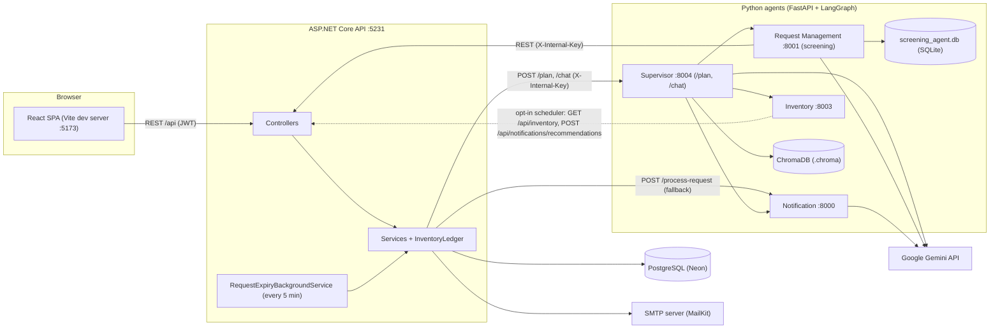
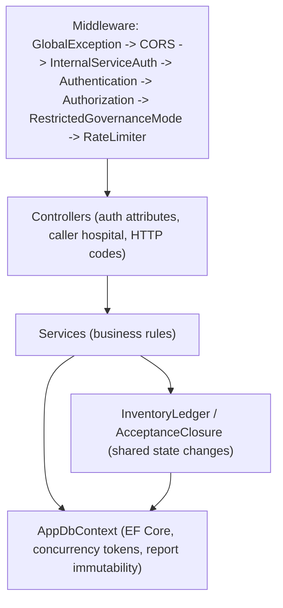
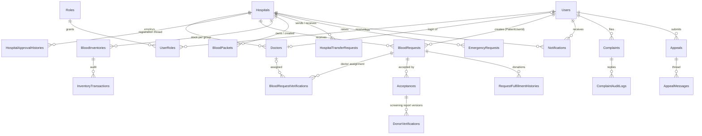
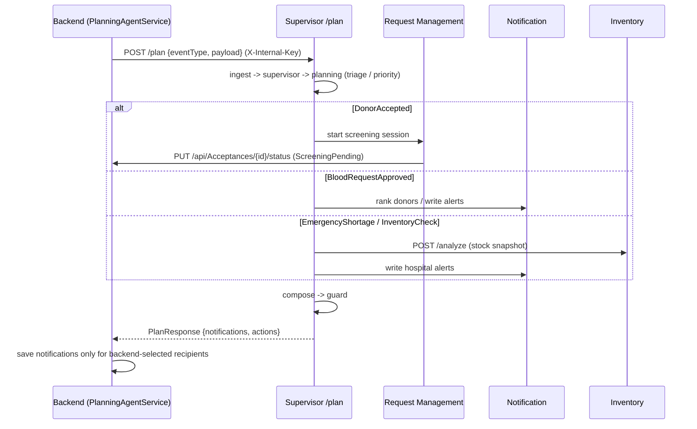
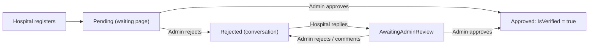
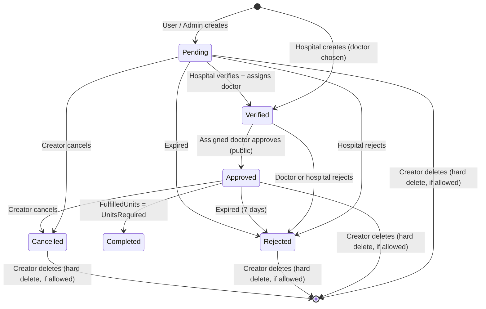
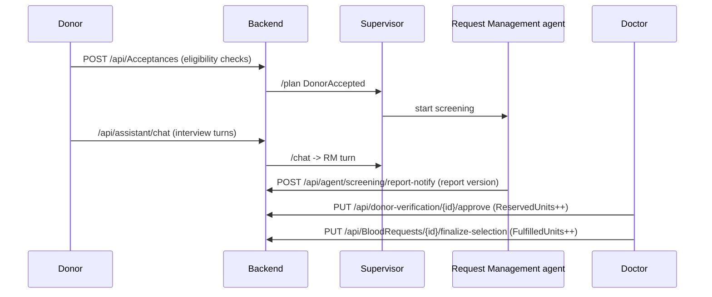
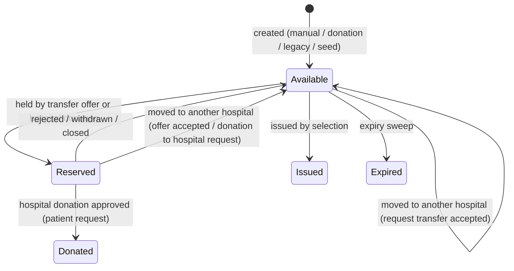
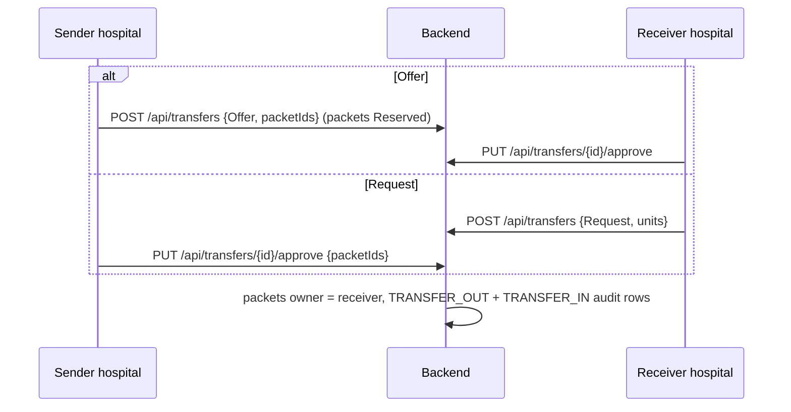

# LifeLink — Project Guide

This guide describes the whole LifeLink repository as it is in the code today: backend, frontend, AI agents, database and the main business flows. Every statement points to the file where it comes from. Items marked **Unclear:** or **Appears unused:** could not be confirmed from the code alone.

> No secrets are included here. Where configuration is needed, only the setting **names** and the files that hold them are listed.

## Contents

1. [Overview](#1-overview)
2. [Tech stack](#2-tech-stack)
3. [Repository structure](#3-repository-structure)
4. [System architecture](#4-system-architecture)
5. [Backend](#5-backend)
6. [Database](#6-database)
7. [Frontend](#7-frontend)
8. [AI agents](#8-ai-agents)
9. [Main business flows](#9-main-business-flows)
10. [Business rules summary](#10-business-rules-summary)
11. [Race condition protection](#11-race-condition-protection)
12. [Session timeout](#12-session-timeout)
13. [Local development](#13-local-development)
14. [Testing](#14-testing)
15. [Known issues and notes](#15-known-issues-and-notes)
16. [Glossary](#16-glossary)

---

## 1. Overview

LifeLink is a blood donation and emergency blood coordination platform (Sri Lanka context: SLMC doctor numbers, PHSRC-registered hospitals). It connects people who need blood, donors, hospitals and hospital doctors:

- A **patient or donor** (or a hospital) creates a **blood request** for a hospital.
- The **hospital** verifies it and assigns one of its **doctors**, who approves it. The request then becomes **public**.
- **Donors** accept public requests and complete an **AI screening interview**. A doctor reviews the report and decides.
- The hospital records the **donation**. Hospitals also keep a **packet-level blood inventory**, move blood between each other (**transfers**), raise **emergencies**, and can **donate from their own inventory** to other hospitals' requests.
- An **Admin** approves hospital registrations, handles complaints, suspensions and appeals.
- AI agents (Python, LangGraph) run screening interviews, write notifications, analyse inventory and power a chatbot. **AI never approves, rejects or makes medical decisions** — doctors and staff do (see [Agents/Supervisor/README.md](Agents/Supervisor/README.md)).

### User roles

Roles are rows in the `Roles` table, seeded in [backend/Data/AppDbcontext.cs](backend/Data/AppDbcontext.cs) (`HasData`), plus one service role:

| Role | Id | Who | Main abilities |
|---|---|---|---|
| `User` | 1 | Donor / patient (self-registered) | Create requests, accept requests and donate, screening interview, complaints, appeals, edit own Pending request |
| `HospitalStaff` | 2 | The hospital's login (identified by the hospital's email) | Verify requests, assign doctors, inventory and packets, transfers, emergencies, donate from inventory, manage doctors |
| `Doctor` | 3 | Doctor accounts created by a hospital | Approve/reject assigned requests, review screening reports, approve/reject hospital donations, record donations |
| `Admin` | 4 | Exactly one platform owner (unique filtered index) | Hospital registration queue, suspend/reinstate/block, complaints, appeals, promote a new Admin |
| `InternalAgent` | — | AI agent services (not a DB role) | Granted by [backend/Middleware/InternalServiceAuthMiddleware.cs](backend/Middleware/InternalServiceAuthMiddleware.cs) when a request carries a valid `X-Internal-Key` header |

---

## 2. Tech stack

| Part | Technology | Versions (from project files) |
|---|---|---|
| Backend API | ASP.NET Core Web API, C# | `net8.0` ([backend/backend.csproj](backend/backend.csproj)) |
| ORM / DB driver | Entity Framework Core + Npgsql | `Npgsql.EntityFrameworkCore.PostgreSQL 8.*`, `Microsoft.EntityFrameworkCore.Design/Tools 8.*` |
| Auth | JWT bearer | `Microsoft.AspNetCore.Authentication.JwtBearer 8.0.*` |
| Email | MailKit (SMTP) | `MailKit 4.18.0` |
| API docs | Swagger (Development only) | `Swashbuckle.AspNetCore 6.6.2` |
| Database | PostgreSQL (Neon hosted) | connection string name `ConnectionStrings:DefaultConnection` |
| Frontend | React + Vite + Tailwind CSS | `react ^19.2.8`, `vite ^8.2.2`, `tailwindcss ^4.3.3`, `react-router-dom ^7.18.4`, `axios ^1.20.0`, `lucide-react ^1.47.0`, `@tanstack/react-query ^5.103.2`, `react-hook-form ^7.88.0`, `zod ^4.6.5` ([frontend/package.json](frontend/package.json)) |
| Frontend lint | ESLint | `eslint ^10.9.0` ([frontend/eslint.config.js](frontend/eslint.config.js)) |
| AI agents | Python, FastAPI, LangGraph, LangChain Google GenAI (Gemini) | see each `requirements.txt`: `fastapi>=0.110`, `langgraph>=0.2` (Inventory: `>=0.0.10`), `langchain-google-genai`, `pydantic>=2` |
| Agent storage | ChromaDB (Supervisor RAG), SQLite/SQLAlchemy + Alembic (Request Management) | `chromadb>=0.5.0`, `sqlalchemy>=2.0.0`, `alembic>=1.13.0` |
| Tests | xUnit + EF Core InMemory + Moq (backend), pytest (agents) | [backend.Tests/backend.Tests.csproj](backend.Tests/backend.Tests.csproj), agent `requirements.txt` |

---

## 3. Repository structure

| Path | What it holds |
|---|---|
| [backend/](backend/) | ASP.NET Core API: [Controllers/](backend/Controllers/), [Services/](backend/Services/), [Entities/](backend/Entities/), [DTOs/](backend/DTOs/), [Data/](backend/Data/) (DbContext), [Middleware/](backend/Middleware/), [Common/](backend/Common/), [Migrations/](backend/Migrations/), [Program.cs](backend/Program.cs) |
| [backend.Tests/](backend.Tests/) | xUnit test project (InMemory EF) |
| [frontend/](frontend/) | React SPA: [src/pages/](frontend/src/pages/), [src/components/](frontend/src/components/), [src/api/](frontend/src/api/), [src/context/](frontend/src/context/), [src/utils/](frontend/src/utils/) |
| [Agents/Supervisor/](Agents/Supervisor/) | LangGraph Supervisor (port 8004): event routing, planning, RAG knowledge, chatbot |
| [Agents/RequestManagement/](Agents/RequestManagement/) | Donor screening interview agent (port 8001) with its own SQLite DB |
| [Agents/Notification/](Agents/Notification/) | Notification writing / donor ranking agent (port 8000) |
| [Agents/InventoryManagement/](Agents/InventoryManagement/) | Inventory analysis agent (port 8003) |
| [docs/authentication-authorization.md](docs/authentication-authorization.md) | Older auth design notes |
| [README.md](README.md) | Existing short project README |

Important backend sub-folders:

| Folder | Contents |
|---|---|
| [backend/Services/Inventory/](backend/Services/Inventory/) | `InventoryLedger` (all packet changes), `BloodInventoryService`, `PacketDateRules`, `InventoryMonitor`, `DevelopmentDataSeeder` |
| [backend/Services/Acceptances/](backend/Services/Acceptances/) | `AcceptanceService` (donor + hospital donations), `AcceptanceClosure` |
| [backend/Services/BloodRequests/](backend/Services/BloodRequests/) | `BloodRequestService`, `RequestExpiryService`, `RequestExpiryBackgroundService` |
| [backend/Services/Common/](backend/Services/Common/) | `CallerHospitalResolver`, `CurrentUserService`, `DonorEligibility`, `DoctorAssignmentRules`, governance/lifecycle helpers |
| [backend/Services/Assistant/](backend/Services/Assistant/) | Chatbot relay + role-scoped snapshot builder |

---

## 4. System architecture



- The frontend calls the backend only through `/api` ([frontend/src/api/client.js](frontend/src/api/client.js), `baseURL: '/api'`). The Vite dev server proxies `/api` to `http://127.0.0.1:5231` ([frontend/vite.config.js](frontend/vite.config.js)).
- The backend calls the Supervisor for events and chat ([backend/Services/Planning/PlanningAgentService.cs](backend/Services/Planning/PlanningAgentService.cs), [backend/Services/Assistant/AssistantService.cs](backend/Services/Assistant/AssistantService.cs)), and the Notification agent directly as a fallback ([backend/Services/Notification/NotificationAgentService.cs](backend/Services/Notification/NotificationAgentService.cs)).
- Agents call back into the backend with the `X-Internal-Key` header ([Agents/RequestManagement/services/backend_client.py](Agents/RequestManagement/services/backend_client.py)).
- CORS allows `http://localhost:5173`, `http://localhost:3000` and `http://127.0.0.1:5173` ([backend/Program.cs](backend/Program.cs)).

### Authentication

- **Login:** `POST /api/Auth/login` ([backend/Services/Auth/AuthService.cs](backend/Services/Auth/AuthService.cs)) checks the password hash and account status (Blocked, Inactive, Deleted and Pending logins are refused), then issues a JWT ([backend/Services/Auth/JwtService.cs](backend/Services/Auth/JwtService.cs)).
- **Token contents:** `sub` and `nameid` (user id), `email`, `given_name`, `family_name`, `jti`, `sid` (the server-side session, see [12. Session timeout](#12-session-timeout)) and one `role` claim per role. HMAC-SHA256 signed; issuer/audience/lifetime from the `Jwt` settings (default lifetime 120 minutes, absolute).
- **Sessions:** every login creates a `UserSessions` row ([backend/Services/Auth/SessionService.cs](backend/Services/Auth/SessionService.cs)); the session ends on sign-out or after `Session:IdleTimeoutMinutes` without user activity.
- **Validation** ([backend/Program.cs](backend/Program.cs)): issuer, audience, signing key and lifetime (zero clock skew). `OnTokenValidated` also rejects tokens of Blocked/Deleted accounts, of a former Admin after an ownership transfer, and tokens whose session is missing, ended or idle (401 with the header `X-Session-Ended`).
- **Frontend session:** the token is stored in `localStorage` as `lifelink_token` ([frontend/src/context/AuthContext.jsx](frontend/src/context/AuthContext.jsx)); on start the app calls `GET /api/Auth/me`. The axios client signs out on 401 in every open tab ([frontend/src/api/client.js](frontend/src/api/client.js), [frontend/src/session/sessionActivity.js](frontend/src/session/sessionActivity.js)).
- **Caller identity:** [backend/Services/Common/CurrentUserService.cs](backend/Services/Common/CurrentUserService.cs) reads user id, email and roles from the token.
- **Caller's hospital:** [backend/Services/Common/CallerHospitalResolver.cs](backend/Services/Common/CallerHospitalResolver.cs): for `HospitalStaff`, the hospital whose `Email` equals the token email; for `Doctor`, the hospital of the active `Doctors` row with that `UserId`. Some controllers use the equivalent `HospitalService.GetHospitalIdByEmailAsync`. Controllers overwrite any hospital id sent in a request body.
- **Internal agents:** [backend/Middleware/InternalServiceAuthMiddleware.cs](backend/Middleware/InternalServiceAuthMiddleware.cs) turns a valid `X-Internal-Key` into an `InternalAgent` principal.
- **Suspended accounts:** [backend/Middleware/RestrictedGovernanceModeMiddleware.cs](backend/Middleware/RestrictedGovernanceModeMiddleware.cs) blocks every endpoint that lacks [`[AllowSuspendedAccess]`](backend/Common/AllowSuspendedAccessAttribute.cs) (Appeals, governance status, `Auth/me`, logout, the activity heartbeat). Doctors of a suspended hospital get read-only access.
- **No global authorization fallback:** endpoints without `[Authorize]` are anonymous (Auth register/login/password reset, `GET /api/profiles/hospital/{id}`, `GET /api/BloodRequests/public`, `POST /api/Hospitals`).

---

## 5. Backend

### Layers



Pipeline order is in [backend/Program.cs](backend/Program.cs). On startup the app runs `Database.Migrate()` and, with `--seed-demo-data` in Development only, [backend/Services/Inventory/DevelopmentDataSeeder.cs](backend/Services/Inventory/DevelopmentDataSeeder.cs).

### Endpoints

Roles: "any signed-in" = `[Authorize]` without roles; "Anonymous" = no auth. Routes use the controller's `[Route]`.

#### AcceptancesController ([backend/Controllers/AcceptancesController.cs](backend/Controllers/AcceptancesController.cs))

| Method | Route | Roles | Purpose |
|---|---|---|---|
| POST | `/api/Acceptances` | User | Donor accepts a blood request. Only donor/patient accounts take part in donation. |
| POST | `/api/Acceptances/hospital` | HospitalStaff | A hospital accepts a public blood request by donating selected Available packets of the required blood group from its own inventory. No AI agent runs |
| PUT | `/api/Acceptances/{id:guid}/hospital-approve` | Doctor | The request's assigned doctor approves a hospital donation; the units are fulfilled at once. |
| PUT | `/api/Acceptances/{id:guid}/hospital-reject` | Doctor | The request's assigned doctor rejects a hospital donation with a reason; the packets return. |
| GET | `/api/Acceptances/my` | any signed-in | Returns all acceptances made by the current donor, with request details and the screening decision history. For hospital staff: the donations their h |
| GET | `/api/Acceptances/{id:guid}` | any signed-in | Returns an acceptance to its donor, the request hospital's doctors and staff, the Admin or the screening agent. |
| PUT | `/api/Acceptances/{id:guid}/cancel` | any signed-in | Donor withdraws. After a doctor's approval the reserved donation slot becomes available again. |
| PUT | `/api/Acceptances/{id:guid}/status` | any signed-in | Screening status changes. The Request Management agent opens the interview (Accepted → ScreeningPending); the donor reopens their own answers while t |
| PUT | `/api/Acceptances/{id:guid}/release` | Doctor, HospitalStaff | A doctor or the hospital's staff releases an acceptance that cannot proceed (no-show, suspended donor). A reserved slot becomes available again. A re |

#### AdminController ([backend/Controllers/AdminController.cs](backend/Controllers/AdminController.cs))

| Method | Route | Roles | Purpose |
|---|---|---|---|
| GET | `/api/Admin/dashboard` | Admin | GetDashboard |
| GET | `/api/Admin/hospitals/pending` | Admin | GetPendingHospitals |
| PUT | `/api/Admin/hospitals/{id:guid}/approve` | Admin | Approves a pending or rejected registration (409 if already approved or a newer hospital reply exists). |
| PUT | `/api/Admin/hospitals/{id:guid}/reject` | Admin | Rejects a pending registration or a hospital reply awaiting review (409 while waiting for the hospital or once approved). |
| POST | `/api/Admin/hospitals/{id:guid}/comments` | Admin | Admin comment in a rejected registration's conversation; the registration stays Rejected. |
| PUT | `/api/Admin/users/{id:guid}/suspend` | Admin | SuspendUser |
| PUT | `/api/Admin/users/{id:guid}/reinstate` | Admin | ReinstateUser |
| PUT | `/api/Admin/users/{id:guid}/block` | Admin | Permanently blocks a donor/patient account (not Admin, HospitalStaff or Doctor accounts, not yourself). |
| PUT | `/api/Admin/users/{id:guid}/promote` | Admin | Transfers Admin ownership to an active donor/patient; the calling Admin becomes a normal User and is signed out. |
| PUT | `/api/Admin/hospitals/{id:guid}/suspend` | Admin | SuspendHospital |
| PUT | `/api/Admin/hospitals/{id:guid}/reinstate` | Admin | ReinstateHospital |
| GET | `/api/Admin/users` | Admin | GetUsers |
| GET | `/api/Admin/hospitals` | Admin | GetAllHospitals |
| GET | `/api/Admin/complaints` | Admin | GetComplaints |
| GET | `/api/Admin/complaints/{id:guid}` | Admin | GetComplaintById |
| PUT | `/api/Admin/complaints/{id:guid}/review` | Admin | Admin reply (the only admin complaint action). Replies alternate with the complaint creator; an optional attachment may be included. Admins cannot re |
| GET | `/api/Admin/activity-reports` | Admin | GetActivityReports |
| GET | `/api/Admin/activity-reports/{id:guid}` | Admin | GetActivityReportById |
| GET | `/api/Admin/appeals` | Admin | GetAppeals |
| PUT | `/api/Admin/appeals/{id:guid}/approve` | Admin | ApproveAppeal |
| PUT | `/api/Admin/appeals/{id:guid}/reject` | Admin | RejectAppeal |
| PUT | `/api/Admin/appeals/{id:guid}/reply` | Admin | ReplyToAppeal |
| PUT | `/api/Admin/appeals/{id:guid}/close` | Admin | Permanently closes an appeal thread (read-only). The suspension itself is unchanged. |
| PUT | `/api/Admin/appeals/{id:guid}/permanently-block` | Admin | PermanentlyBlockAppeal |

#### AppealsController ([backend/Controllers/AppealsController.cs](backend/Controllers/AppealsController.cs))

| Method | Route | Roles | Purpose |
|---|---|---|---|
| POST | `/api/Appeals` | any signed-in (suspended accounts allowed) | Submit an appeal against a suspension (one open thread at a time). |
| POST | `/api/Appeals/{id:guid}/reply` | any signed-in (suspended accounts allowed) | Appellant reply (with optional attachment), allowed after an admin message. Doctors can only view threads. |
| GET | `/api/Appeals/my` | any signed-in (suspended accounts allowed) | Retrieves the current user's submitted appeals. |

#### AssistantController ([backend/Controllers/AssistantController.cs](backend/Controllers/AssistantController.cs))

| Method | Route | Roles | Purpose |
|---|---|---|---|
| POST | `/api/assistant/chat` | User, HospitalStaff, Doctor, Admin | Sends a message to the assistant. With acceptanceId it is a turn of the donor's own screening interview (an empty message resumes the interview). |

#### AuthController ([backend/Controllers/AuthController.cs](backend/Controllers/AuthController.cs))

| Method | Route | Roles | Purpose |
|---|---|---|---|
| POST | `/api/Auth/register` | Anonymous | Registers a new LifeLink user account. |
| POST | `/api/Auth/login` | Anonymous | Authenticates user and returns JWT access token. |
| POST | `/api/Auth/logout` | Anonymous (suspended accounts allowed) | Ends the caller's server-side session (every tab and any copy of the token stop working). `?reason=idle` records the end as an idle timeout. |
| POST | `/api/Auth/activity` | any signed-in (suspended accounts allowed) | Heartbeat: the user is active (mouse, keyboard, touch, scroll, "Stay signed in"); moves the session on and returns the idle settings. |
| GET | `/api/Auth/me` | any signed-in | Gets the current authenticated user's profile information. |
| DELETE | `/api/Auth/me` | User | Donor/patient deletes their own account: personal data and login removed, history kept (shown as "Deleted User"). The same email can register again. |
| GET | `/api/Auth/user/{id:guid}` | InternalAgent, Admin, HospitalStaff | Retrieves minimal user profile for AI donor screening (Least Privilege: ID, Name, Gender, DOB only). |
| POST | `/api/Auth/forgot-password` | Anonymous | Initiates password reset flow by sending a 6-digit OTP code to the requested email (Anti-enumeration enabled). |
| POST | `/api/Auth/verify-otp` | Anonymous | Verifies a 6-digit OTP code and returns a reset session token upon success. |
| POST | `/api/Auth/resend-otp` | Anonymous | Resends a 6-digit verification OTP code to the user's email. |
| POST | `/api/Auth/reset-password` | Anonymous | Resets password after successful OTP verification. |
| POST | `/api/Auth/change-password` | any signed-in | Changes password for currently authenticated user. |

#### BloodRequestsController ([backend/Controllers/BloodRequestsController.cs](backend/Controllers/BloodRequestsController.cs))

| Method | Route | Roles | Purpose |
|---|---|---|---|
| POST | `/api/BloodRequests` | User, HospitalStaff, Admin | User (Donor/Patient), Hospital staff or Admin creates a blood request. Doctors cannot. Hospital staff always request for their own hospital; others m |
| PUT | `/api/BloodRequests/{id:guid}` | User | The patient who created a request edits its blood group and units while it is still Pending. Only donor/patient accounts can use this; hospitals, doc |
| GET | `/api/BloodRequests/my` | any signed-in | Returns blood requests created by the current user. |
| GET | `/api/BloodRequests/hospital` | HospitalStaff | Returns every blood request sent to the signed-in hospital (all statuses, including rejected). |
| GET | `/api/BloodRequests/assigned` | Doctor | Returns blood requests assigned to the signed-in doctor. |
| DELETE | `/api/BloodRequests/{id:guid}` | any signed-in (creator only, 403 otherwise) | Creator permanently deletes their own request (any status) when no donor or hospital donation is active, no donor was screened (cancel instead) and nothing was donated. A concurrent acceptance gives 409. |
| GET | `/api/BloodRequests/public` | Anonymous | Returns public active approved blood requests for donors and agents. |
| GET | `/api/BloodRequests/pending` | HospitalStaff, Admin | Returns pending blood requests for hospital verification dashboard. |
| GET | `/api/BloodRequests/{id:guid}` | any signed-in | Returns request details by ID. |
| PUT | `/api/BloodRequests/{id:guid}/cancel` | any signed-in | Creator cancels the blood request. |
| GET | `/api/BloodRequests/{id:guid}/acceptances` | Doctor, HospitalStaff, Admin | Returns the donors (with contact details) who accepted a request: only for the doctors and staff of the hospital handling it, and the Admin. |
| PUT | `/api/BloodRequests/{id:guid}/finalize-selection` | Doctor, HospitalStaff | Record donations: an active doctor of the hospital or the hospital's staff confirms that approved donors donated (with the tested blood group). Fulfi |
| GET | `/api/BloodRequests/{id:guid}/analytics` | any signed-in | Returns blood request fulfillment analytics for LangGraph agent and dashboards. |
| GET | `/api/BloodRequests/{id:guid}/fulfillment-history` | any signed-in | Returns fulfillment history audit trail for a blood request. |

#### ComplaintsController ([backend/Controllers/ComplaintsController.cs](backend/Controllers/ComplaintsController.cs))

| Method | Route | Roles | Purpose |
|---|---|---|---|
| POST | `/api/Complaints` | User, HospitalStaff | Submits a complaint or feedback regarding the platform or hospital operations. Accepts an `Idempotency-Key` header. |
| POST | `/api/Complaints/{id:guid}/reply` | User, HospitalStaff | Creator reply with an optional attachment. Allowed only after an admin reply (replies alternate). |
| GET | `/api/Complaints/my-complaints` | User, HospitalStaff | Gets all complaints submitted by the currently authenticated user. |
| PUT | `/api/Complaints/{id:guid}/solve` | User, HospitalStaff | Marks a complaint as solved by its creator. |
| PUT | `/api/Complaints/{id:guid}/cancel` | User, HospitalStaff | Creator permanently deletes their complaint (any status) with its replies/audit log and activity reports. |

#### DoctorsController ([backend/Controllers/DoctorsController.cs](backend/Controllers/DoctorsController.cs))

| Method | Route | Roles | Purpose |
|---|---|---|---|
| POST | `/api/Doctors` | HospitalStaff | Creates a new Doctor account. Only Hospital Staff may call this endpoint. The HospitalId in the request body is verified against the authenticated ho |
| GET | `/api/Doctors` | HospitalStaff, Admin | Returns doctors for the authenticated hospital (or all doctors for Admins). |
| GET | `/api/Doctors/{id:guid}` | HospitalStaff, Admin, Doctor | Returns a specific Doctor by ID. Hospital Staff can only fetch doctors from their own hospital. |
| DELETE | `/api/Doctors/{id:guid}` | HospitalStaff | Deletes a doctor created by the authenticated hospital, including the doctor's login account. Blood request history handled by the doctor is preserve |

#### DonorVerificationController ([backend/Controllers/DonorVerificationController.cs](backend/Controllers/DonorVerificationController.cs))

| Method | Route | Roles | Purpose |
|---|---|---|---|
| PUT | `/api/donor-verification/{id:guid}/approve` | Doctor | Approve a report version: reserves one donation slot. Optional notes are shown to the donor. |
| PUT | `/api/donor-verification/{id:guid}/reject` | Doctor | Reject a report version with a reason the donor sees. The request stays open to other donors. |
| GET | `/api/donor-verification` | Doctor, Admin | Report versions and decisions: a doctor's own hospital, or everything for the Admin. |

#### EmergencyRequestsController ([backend/Controllers/EmergencyRequestsController.cs](backend/Controllers/EmergencyRequestsController.cs))

| Method | Route | Roles | Purpose |
|---|---|---|---|
| POST | `/api/emergencyrequests` | HospitalStaff | The signed-in hospital raises an emergency; hospitals holding compatible stock are alerted. Accepts an `Idempotency-Key` header. |
| GET | `/api/emergencyrequests` | HospitalStaff, Admin | Retrieves all emergency blood requests. |
| GET | `/api/emergencyrequests/critical` | HospitalStaff, Admin | Retrieves critical priority emergency blood requests. |
| GET | `/api/emergencyrequests/{id:guid}` | HospitalStaff, Admin | Retrieves a specific emergency blood request by ID. |
| PUT | `/api/emergencyrequests/{id:guid}/approve` | HospitalStaff | Approves an emergency blood request. |
| PUT | `/api/emergencyrequests/{id:guid}/reject` | HospitalStaff | Rejects an emergency blood request. |
| PUT | `/api/emergencyrequests/{id:guid}/complete` | HospitalStaff | Completes an emergency blood request. |

#### GovernanceStatusController ([backend/Controllers/GovernanceStatusController.cs](backend/Controllers/GovernanceStatusController.cs))

| Method | Route | Roles | Purpose |
|---|---|---|---|
| GET | `/api/governance/status` | any signed-in | Governance Portal data for the caller: profile summary, suspension reason, appeal threads and what they may do. Suspended users and staff of a suspen |

#### HospitalActivityReportsController ([backend/Controllers/HospitalActivityReportsController.cs](backend/Controllers/HospitalActivityReportsController.cs))

| Method | Route | Roles | Purpose |
|---|---|---|---|
| POST | `/api/hospital/activity-reports` | HospitalStaff | Submits an activity report or supporting evidence requested by Admin during an investigation. |

#### HospitalsController ([backend/Controllers/HospitalsController.cs](backend/Controllers/HospitalsController.cs))

| Method | Route | Roles | Purpose |
|---|---|---|---|
| POST | `/api/Hospitals` | Anonymous | CreateHospital |
| GET | `/api/Hospitals` | any signed-in | Hospital directory for signed-in users: summary fields only. |
| GET | `/api/Hospitals/me` | HospitalStaff | The signed-in hospital staff member's own hospital, with its registration conversation. |
| GET | `/api/Hospitals/{id:guid}` | any signed-in | A hospital's full record: admins, or that hospital's own staff. |
| PUT | `/api/Hospitals/{id:guid}/verify` | Admin | Legacy verification switch; admins only (the approval queue uses /api/Admin/hospitals). |
| POST | `/api/Hospitals/{id:guid}/replies` | HospitalStaff | The hospital's reply in its rejected registration's conversation, optionally correcting details and documents. Only that hospital's staff, and only w |

#### InventoryController ([backend/Controllers/InventoryController.cs](backend/Controllers/InventoryController.cs))

| Method | Route | Roles | Purpose |
|---|---|---|---|
| POST | `/api/Inventory` | HospitalStaff | Creates a blood group category (thresholds only) for the signed-in hospital. Stock arrives as packets. |
| GET | `/api/Inventory` | HospitalStaff, Admin, InternalAgent | Retrieves all blood inventory records across hospitals. |
| GET | `/api/Inventory/low-stock` | HospitalStaff, Admin, InternalAgent | Retrieves low-stock blood inventory records (units available |
| GET | `/api/Inventory/surplus` | HospitalStaff, Admin, InternalAgent | Retrieves surplus blood inventory records (units available >= 80% maximum capacity). |
| GET | `/api/Inventory/{id:guid}` | HospitalStaff, Admin, InternalAgent | Retrieves a specific blood inventory record by ID. |
| GET | `/api/Inventory/{id:guid}/transactions` | HospitalStaff, Admin, InternalAgent | Retrieves transaction audit history for a specific blood inventory record. |
| PUT | `/api/Inventory/{id:guid}` | HospitalStaff | Updates thresholds of the hospital's own category and issues the packets listed in IssuePacketIds (with AuditNotes as the reason). The unit count can |
| DELETE | `/api/Inventory/{id:guid}` | HospitalStaff | Deletes a blood inventory record. |
| GET | `/api/Inventory/packets` | HospitalStaff, Admin, InternalAgent | Blood packets with expiry and source. Hospital staff see their own hospital's packets; with packetId a single packet is returned with its full audit |
| POST | `/api/Inventory/packets` | HospitalStaff | Hospital staff enter collected blood as packets (blood group, mandatory collected date that is not in the future, quantity 1-20). Each packet gets a unique tracking number. Accepts an `Idempotency-Key` header. |
| PUT | `/api/Inventory/packets/{packetId:guid}` | HospitalStaff | Edits a packet's blood group and collected date. Only the hospital that created the packet may edit it (403 otherwise), and only while it owns the pa |
| GET | `/api/Inventory/hospital/{hospitalId:guid}` | HospitalStaff, Admin, InternalAgent | Retrieves all blood inventory records for a specific hospital. |

#### MatchingController ([backend/Controllers/MatchingController.cs](backend/Controllers/MatchingController.cs))

| Method | Route | Roles | Purpose |
|---|---|---|---|
| POST | `/api/matching/create` | Doctor, Admin | CreateMatch |
| GET | `/api/matching` | Doctor, Admin, InternalAgent | GetMatches |
| GET | `/api/matching/{id:guid}` | Doctor, Admin, InternalAgent | GetMatchById |

#### NotificationsController ([backend/Controllers/NotificationsController.cs](backend/Controllers/NotificationsController.cs))

| Method | Route | Roles | Purpose |
|---|---|---|---|
| GET | `/api/notifications` | Admin | Every notification in the system (all users). Admin only. |
| GET | `/api/notifications/my` | any signed-in | GetMyNotifications |
| GET | `/api/notifications/unread-count` | any signed-in | GetUnreadCount |
| PATCH | `/api/notifications/{id:guid}/read` | any signed-in | MarkAsRead |
| DELETE | `/api/notifications/{id:guid}` | any signed-in | Dismisses (permanently deletes) one of the caller's own notifications. |
| PATCH | `/api/notifications/read-all` | any signed-in | MarkAllAsRead |
| GET | `/api/notifications/user/{userId:guid}` | any signed-in | A user's notifications: only that user, the Admin, or internal agent services. |
| POST | `/api/notifications/recommendations` | Admin, InternalAgent | Creates a recommendation notification generated by AI Agents (authenticated with X-Internal-Key) or the Admin. |

#### ProfilesController ([backend/Controllers/ProfilesController.cs](backend/Controllers/ProfilesController.cs))

| Method | Route | Roles | Purpose |
|---|---|---|---|
| GET | `/api/profiles/hospital/{id:guid}` | Anonymous | Gets a hospital profile. Public / all users can view hospital profiles. Donors and patients cannot see blood inventory details. Hospital Staff, Docto |
| GET | `/api/profiles/user/{id:guid}` | any signed-in | Gets a user profile. Admin profiles can only be viewed by administrators. |
| GET | `/api/profiles/doctor/{id:guid}` | any signed-in | Gets a doctor profile with affiliated hospital details. |
| GET | `/api/profiles/me` | any signed-in | Resolves the caller's own profile page: doctor profile for Doctors, hospital profile for Hospital Staff, otherwise the user profile (Users and Admins |
| PUT | `/api/profiles/user/{id:guid}` | User, Admin | Users and Admins edit their own user profile. Email cannot be changed. |
| PUT | `/api/profiles/doctor/{id:guid}` | Doctor | Doctors edit their own doctor profile (hospitals cannot edit doctor details). The SLMC number must stay unique; name and phone are kept in sync with |
| PUT | `/api/profiles/hospital/{id:guid}` | HospitalStaff | Hospital staff edit their own approved hospital's profile. Email, license number and registration number cannot be changed. Before approval, details |

#### RequestsVerificationController ([backend/Controllers/RequestsVerificationController.cs](backend/Controllers/RequestsVerificationController.cs))

| Method | Route | Roles | Purpose |
|---|---|---|---|
| PUT | `/api/requests/{id:guid}/verify` | HospitalStaff | Hospital verifies a pending request and assigns one of its doctors (DoctorId is mandatory). |
| PUT | `/api/requests/{id:guid}/approve` | Doctor | Assigned doctor approves a verified request. Optional Notes are stored with the decision. |
| PUT | `/api/requests/{id:guid}/reject` | HospitalStaff, Doctor | Rejects a request with a mandatory message (Notes). Hospital staff may reject requests sent to their hospital; doctors may reject requests assigned t |
| GET | `/api/requests/verifications` | Admin | Raw verification audit list (admin oversight only). |

#### ScreeningAgentController ([backend/Controllers/ScreeningAgentController.cs](backend/Controllers/ScreeningAgentController.cs))

| Method | Route | Roles | Purpose |
|---|---|---|---|
| POST | `/api/agent/screening/report-notify` | InternalAgent | The Request Management agent submits a completed screening report. Each submission is stored as a new immutable version and routed to the assigned do |

#### SearchController ([backend/Controllers/SearchController.cs](backend/Controllers/SearchController.cs))

| Method | Route | Roles | Purpose |
|---|---|---|---|
| GET | `/api/search` | any signed-in | GlobalSearch |

#### TransferRequestsController ([backend/Controllers/TransferRequestsController.cs](backend/Controllers/TransferRequestsController.cs))

| Method | Route | Roles | Purpose |
|---|---|---|---|
| POST | `/api/transfers` | HospitalStaff | Creates a transfer "Request" (ask for blood) or "Offer" (send blood) to another hospital. Accepts an `Idempotency-Key` header. |
| GET | `/api/transfers` | HospitalStaff, Admin | The signed-in hospital's incoming and outgoing transfers (all transfers for the Admin). |
| GET | `/api/transfers/pending` | HospitalStaff, Admin | GetPendingTransferRequests |
| GET | `/api/transfers/{id:guid}` | HospitalStaff, Admin | A transfer the signed-in hospital takes part in, with the IDs of the packets it moved. |
| PUT | `/api/transfers/{id:guid}/approve` | HospitalStaff | The counterpart hospital accepts: packets move immediately and the transfer completes. A sender accepting a "Request" sends { packetIds } with exactl |
| PUT | `/api/transfers/{id:guid}/reject` | HospitalStaff | The counterpart hospital rejects with a reason; the rejection stays in history. |
| DELETE | `/api/transfers/{id:guid}` | HospitalStaff | The creator deletes a pending transfer; it stays in history as Cancelled. |

### Key services

| Service | File | What it does |
|---|---|---|
| `InventoryLedger` | [backend/Services/Inventory/InventoryLedger.cs](backend/Services/Inventory/InventoryLedger.cs) | The only code that creates, reserves, releases, moves, issues, donates, edits or expires packets. Writes one `InventoryTransactions` row per packet change and keeps `BloodInventories.UnitsAvailable` equal to Available packets in the same save. Assigns tracking numbers from the DB sequence. Converts concurrency failures into `ConflictException` (409). |
| `BloodInventoryService` | [backend/Services/Inventory/BloodInventoryService.cs](backend/Services/Inventory/BloodInventoryService.cs) | Blood group categories (thresholds/capacity), packet creation and editing, issuing selected packets, packet lists with `CanEdit`, low-stock/surplus lists, expiry sweep entry point. |
| `PacketDateRules` | [backend/Services/Inventory/PacketDateRules.cs](backend/Services/Inventory/PacketDateRules.cs) | Collected date: required, not in the future ("today" = Sri Lanka date, UTC+05:30), not already past shelf life. |
| `InventoryMonitor` | [backend/Services/Inventory/InventoryMonitor.cs](backend/Services/Inventory/InventoryMonitor.cs) | Periodic low-stock / expiring-soon check, sent as the `InventoryCheck` event to the Supervisor. |
| `BloodRequestService` | [backend/Services/BloodRequests/BloodRequestService.cs](backend/Services/BloodRequests/BloodRequestService.cs) | Create (doctor mandatory for hospital staff; hospital requests start Verified), edit Pending request (patient only), lists (my / hospital / assigned / public / pending) with delete flags, hard delete with notifications, cancel, expiry, analytics. |
| `VerificationService` | [backend/Services/Verification/VerificationService.cs](backend/Services/Verification/VerificationService.cs) | Hospital verify (assign doctor) / reject, doctor approve / reject request, doctor approve / reject screening report versions (reserves a slot). Sends `BloodRequestApproved` to the Supervisor. |
| `AcceptanceService` | [backend/Services/Acceptances/AcceptanceService.cs](backend/Services/Acceptances/AcceptanceService.cs) | Donor accept (eligibility, `DonorAccepted` event), withdraw, release, reopen screening, screening report submission, record donation (finalize), hospital donations (accept with packets, withdraw, approve, reject). |
| `AcceptanceClosure` | [backend/Services/Acceptances/AcceptanceClosure.cs](backend/Services/Acceptances/AcceptanceClosure.cs) | Closes acceptances without deleting: releases a reserved slot, closes pending report versions, releases a hospital donation's held packets. Used by withdraw, release, delete, expiry and fulfilment. |
| `TransferRequestService` | [backend/Services/Transfer/TransferRequestService.cs](backend/Services/Transfer/TransferRequestService.cs) | Transfer Request / Offer create, approve (packets move), reject, withdraw (held packets return). |
| `EmergencyRequestService` | [backend/Services/Emergency/EmergencyRequestService.cs](backend/Services/Emergency/EmergencyRequestService.cs) | Emergencies: finds hospitals with compatible unexpired packets and alerts them (`EmergencyShortage` event). Completing does not deduct stock. |
| `CallerHospitalResolver` | [backend/Services/Common/CallerHospitalResolver.cs](backend/Services/Common/CallerHospitalResolver.cs) | Hospital of the signed-in staff account or doctor. |
| `DoctorAssignmentRules` | [backend/Services/Common/DoctorAssignmentRules.cs](backend/Services/Common/DoctorAssignmentRules.cs) | A doctor may be assigned only if they belong to the hospital, are active and have a login. |
| `DonorEligibility` | [backend/Services/Common/DonorEligibility.cs](backend/Services/Common/DonorEligibility.cs) | Active account, 120-day donation interval, age 18–60, confirmed blood group. |
| `NotificationFactory` | [backend/Services/Notification/NotificationFactory.cs](backend/Services/Notification/NotificationFactory.cs) | Builds in-app `Notifications` rows for users or hospitals. |
| `NotificationAgentService` | [backend/Services/Notification/NotificationAgentService.cs](backend/Services/Notification/NotificationAgentService.cs) | Eligible donor candidates, alert hospitals, direct call to the Notification agent (fallback), saves agent notifications only for backend-chosen recipients. |
| `PlanningAgentService` | [backend/Services/Planning/PlanningAgentService.cs](backend/Services/Planning/PlanningAgentService.cs) | `POST {PlanningAgent:BaseUrl}/plan` to the Supervisor. |
| `AssistantService` / `AssistantContextBuilder` | [backend/Services/Assistant/](backend/Services/Assistant/) | Chat relay to Supervisor `/chat` with a role-scoped snapshot of the caller's own data. |
| `AdminService`, `AppealService`, `ComplaintService`, `HospitalService`, `DoctorService`, `AuthService` | [backend/Services/](backend/Services/) | Governance, registration conversation, doctors, auth and password reset (OTP). |
| `SessionService` | [backend/Services/Auth/SessionService.cs](backend/Services/Auth/SessionService.cs) | Server-side sessions for the idle timeout: started on login, checked (and, for user activity, moved on) on every request, ended on sign-out or idle. See [12. Session timeout](#12-session-timeout). |
| `DatabaseConflicts` | [backend/Common/DatabaseConflicts.cs](backend/Common/DatabaseConflicts.cs) | Turns race-related save failures (moved concurrency token, unique index, foreign key) into a 409 message. See [11. Race condition protection](#11-race-condition-protection). |
| `BackgroundJobLeases` | [backend/Services/BloodRequests/BackgroundJobLeases.cs](backend/Services/BloodRequests/BackgroundJobLeases.cs) | Lease row so only one backend instance runs the background sweep. |

### Error handling and background work

- [backend/Middleware/GlobalExceptionMiddleware.cs](backend/Middleware/GlobalExceptionMiddleware.cs) maps exceptions: `DbUpdateConcurrencyException`, unique-index and foreign-key violations (through [DatabaseConflicts.cs](backend/Common/DatabaseConflicts.cs)) and `ConflictException` → **409**, `UnauthorizedAccessException` → 401, `KeyNotFoundException` → 404, `InvalidOperationException` → 400, anything else → 500. Most controllers catch exceptions themselves and return **403** for `UnauthorizedAccessException` (ownership / role checks) and 400/404 as appropriate; their `InvalidOperationException` handlers skip `ConflictException`, so conflicts always reach the middleware as 409.
- **Concurrency:** blood requests, acceptances, appeals, complaints, hospitals, users, transfers and emergencies have integer concurrency tokens that `AppDbContext.SaveChanges*` moves on automatically ([backend/Data/AppDbcontext.cs](backend/Data/AppDbcontext.cs)); the ledger bumps packet and inventory tokens. Details in [11. Race condition protection](#11-race-condition-protection).
- **Screening report immutability:** `AppDbContext` refuses to delete `DonorVerifications` rows or change a submitted report's content.
- **Background job:** [backend/Services/BloodRequests/RequestExpiryBackgroundService.cs](backend/Services/BloodRequests/RequestExpiryBackgroundService.cs) runs every 5 minutes: expires requests past `ExpiryDate` (each request in its own save), sweeps expired packets (each hospital + blood group in its own save), removes idempotency keys older than 24 hours, and (if `InventoryMonitoring:Enabled`) runs the inventory check every `InventoryMonitoring:IntervalMinutes` (minimum 5, default 30). A round runs only on the backend instance that holds the sweep lease (`BackgroundJobLeases`, renewed every round, 7-minute lease). A row that a user changes at the same moment is skipped and retried in the next round.
- **Rate limit:** policy `assistant`, 20 requests per minute per user ([backend/Program.cs](backend/Program.cs)).

### Configuration (names only)

Set in [backend/appsettings.json](backend/appsettings.json), overridden by `backend/appsettings.Development.json` (git-ignored) or environment variables (`__` for `:`):

| Setting | Used by |
|---|---|
| `ConnectionStrings:DefaultConnection` | EF Core (PostgreSQL) |
| `Jwt:Key`, `Jwt:Issuer`, `Jwt:Audience`, `Jwt:ExpiryMinutes` | JWT issue and validation |
| `Session:IdleTimeoutMinutes` (default 10), `Session:WarningMinutes` (default 1) | Idle timeout and warning time ([backend/Services/Auth/SessionService.cs](backend/Services/Auth/SessionService.cs)) |
| `InternalService:ApiKey` | Shared key for agent calls (`X-Internal-Key`) |
| `PlanningAgent:BaseUrl` | Supervisor URL (default in code `http://localhost:8004` / `http://127.0.0.1:8004`) |
| `NotificationAgent:BaseUrl` | Notification agent URL (default in code `http://localhost:8000`) |
| `InventoryMonitoring:Enabled`, `InventoryMonitoring:IntervalMinutes` | Periodic inventory check |
| `Smtp:Host`, `Smtp:Port`, `Smtp:Username`, `Smtp:Password`, `Smtp:FromEmail`, `Smtp:FromName` | [backend/Services/Auth/MailKitEmailService.cs](backend/Services/Auth/MailKitEmailService.cs) (it also reads `Smtp:User` / `Smtp:Pass`) |
| `Logging:*`, `AllowedHosts` | ASP.NET Core defaults |

---

## 6. Database

PostgreSQL through EF Core ([backend/Data/AppDbcontext.cs](backend/Data/AppDbcontext.cs)). Most ids are `uuid`. Many cross-references are **plain id columns without database foreign keys** (for example `DonorVerifications.AcceptanceId`, `BloodRequestVerifications.BloodRequestId`, `RequestFulfillmentHistories.BloodRequestId`, `InventoryTransactions.ReferenceId`); rows are linked in code. `Acceptances.BloodRequestId` **is** a foreign key to `BloodRequests` with `Restrict`, so a request cannot be removed while an acceptance references it and an acceptance cannot be created for a request that was just deleted.

### Tables

| Table (entity) | Main fields | Relationships |
|---|---|---|
| `Users` ([User.cs](backend/Entities/User.cs)) | name, `Email` (unique), `PasswordHash`, phone, `DateOfBirth`, `Gender`, `BloodGroup`, `LastDonationDate`, `AccountStatus`, `IsSuspended`, `SuspendedUntil`, `IsPermanentlyBlocked`, `ConcurrencyToken` | `UserRoles` |
| `UserSessions` ([UserSession.cs](backend/Entities/UserSession.cs)) | `SessionId` (the token's `sid`), `UserId`, `CreatedAt`, `LastActivityAt`, `EndedAt`, `EndReason` (`SignedOut`, `Idle`) | → `Users` (cascade) |
| `Roles`, `UserRoles` | role name; user–role pairs | many-to-many users/roles |
| `PasswordResetTokens` | `TokenHash`, `Otp`, `IsVerified`, `ResetSessionToken`, `ExpiresAt`, `UsedAt` | → `Users` |
| `Hospitals` ([Hospital.cs](backend/Entities/Hospital.cs)) | `Name`, `Email`, `LicenseNumber`, `RegistrationNumber` (unique), `IsVerified`, `ApprovalStatus`, suspension fields, `PacketShelfLifeDays` (21–35), `ExpiryAlertDays` (1–20), documents, `ConcurrencyToken` | doctors, inventories, transfers, approval history |
| `HospitalApprovalHistories` | registration conversation entries (`Status` = entry type), admin, comments, documents | → `Hospitals` |
| `Doctors` ([Doctor.cs](backend/Entities/Doctor.cs)) | name, `Email`, `LicenseNumber` (SLMC, unique), `IsActive`, `MustChangePassword`, `UserId` | → `Hospitals` (cascade), → `Users` (set null) |
| `BloodRequests` ([BloodRequest.cs](backend/Entities/BloodRequest.cs)) | `PatientUserId` (creator), `HospitalId`, `BloodGroup`, `UnitsRequired` (1–10), `FulfilledUnits`, `ReservedUnits`, `Priority`, `Status`, `ExpiryDate` (+7 days), `RejectionReason`, `ConcurrencyToken` | check constraints on units; partial unique index: one `Pending`/`Verified`/`Approved` request per creator + hospital + blood group |
| `BloodRequestVerifications` | `BloodRequestId`, `DoctorId` (assigned doctor), `Status`, `Notes` | → `Doctors` (set null) |
| `Acceptances` ([Acceptance.cs](backend/Entities/Acceptance.cs)) | `BloodRequestId`, `DonorUserId`, `DonorHospitalId` (hospital donation), `Status`, `RejectionReason`, `ConcurrencyToken` | → `BloodRequests` (foreign key, restrict) |
| `DonorVerifications` ([DonorVerification.cs](backend/Entities/DonorVerification.cs)) | screening report versions: `AcceptanceId`, `ReportVersion`, `ReportJson`, `Status`, `DoctorId`, `DecidedByDoctorId`, `Notes` | unique (`AcceptanceId`, `ReportVersion`) |
| `RequestFulfillmentHistories` | `BloodRequestId`, `AcceptanceId`, `DonorUserId`, `FulfilledAt` | id links |
| `DonorPatientMatches` | `BloodRequestId`, `DonorUserId`, `DoctorId`, `Status` | → `Doctors` |
| `BloodInventories` ([BloodInventory.cs](backend/Entities/BloodInventory.cs)) | `HospitalId`, `BloodGroup` (unique pair), `UnitsAvailable`, `MinimumThreshold`, `MaximumCapacity`, `ConcurrencyToken` | → `Hospitals` |
| `BloodPackets` ([BloodPacket.cs](backend/Entities/BloodPacket.cs)) | `TrackingNumber` (unique, immutable), `CreatedByHospitalId` (immutable), `HospitalId` (owner), `BloodGroup`, `CollectionDate`, `ExpiryDate`, `Status`, `Source`, `SourceReferenceId`, `HeldForReferenceId`, `CreatedAt` (immutable) | → `Hospitals` ×2 (restrict) |
| `InventoryTransactions` | per-packet audit: `InventoryId`, `TransactionType`, `PacketId`, `ReferenceId`, `PerformedByUserId`, `Notes` | → `BloodInventories` |
| `HospitalTransferRequests` | `SenderHospitalId`, `ReceiverHospitalId`, `BloodGroup`, `UnitsRequested`, `TransferType`, `Status`, `RejectionReason`, `ConcurrencyToken` | → `Hospitals` ×2 |
| `EmergencyRequests` | `HospitalId`, `BloodGroup`, `UnitsRequired`, `Priority`, `Status`, `Reason`, `ConcurrencyToken` | → `Hospitals` |
| `Notifications` ([Notification.cs](backend/Entities/Notification.cs)) | `UserId` or `HospitalId`, `Title`, `Message`, `NotificationType`, `RecipientRole`, `IsRead` | no link to the object it is about |
| `Complaints`, `ComplaintAuditLogs`, `HospitalActivityReports` | complaint thread, admin replies (audit log), requested hospital reports; `Complaints.ConcurrencyToken` | → users / hospitals / complaint |
| `Appeals`, `AppealMessages` | suspension appeal threads; `Appeals.ConcurrencyToken`; partial unique indexes: one open (`PENDING`/`REJECTED`) appeal per account and per hospital | → users / hospitals |
| `IdempotencyKeys` ([IdempotencyKey.cs](backend/Entities/IdempotencyKey.cs)) | `Key` (primary key, `{userId}:{client key}`), `UserId`, `Endpoint`, `CreatedAt` (removed after 24 hours) | — |
| `BackgroundJobLeases` ([BackgroundJobLease.cs](backend/Entities/BackgroundJobLease.cs)) | `Name` (primary key, `BackgroundSweep`), `Holder` (backend instance), `LeasedUntil` | — |
| Sequence `BloodPacketTrackingNumbers` | source of packet tracking numbers | — |



### Status values

| Entity | Values | Source |
|---|---|---|
| Blood request | `Pending`, `Verified`, `Approved`, `Rejected`, `Completed`, `Cancelled`, `Deleted` (only on requests soft-deleted before hard delete was introduced) | [BloodRequestStatus.cs](backend/Entities/BloodRequestStatus.cs) |
| Acceptance | `Accepted`, `ScreeningPending`, `ScreeningCompleted`, `Verified`, `Matched`, `Rejected`, `Cancelled` | [AcceptanceStatus.cs](backend/Entities/AcceptanceStatus.cs) |
| Verification / screening report | `Pending`, `Approved`, `Rejected`, `Superseded`, `Closed` | [VerificationStatus.cs](backend/Entities/VerificationStatus.cs) |
| Packet status | `Available`, `Reserved`, `Issued`, `Donated`, `Expired` | [BloodPacket.cs](backend/Entities/BloodPacket.cs) |
| Packet source | `Donation`, `Manual`, `Legacy`, `Seed` | [BloodPacket.cs](backend/Entities/BloodPacket.cs) |
| Inventory transaction type | `INITIAL_STOCK`, `ADD`, `DEDUCT`, `TRANSFER_IN`, `TRANSFER_OUT`, `EMERGENCY_DISPATCH`, `ADJUSTMENT`, `DONATION_COLLECTED`, `ISSUED`, `EXPIRED`, `LEGACY_MIGRATED`, `SEEDED`, `RESERVED`, `RELEASED`, `DONATED`, `DONATION_RECEIVED` | [TransactionType.cs](backend/Entities/TransactionType.cs) |
| Transfer | status `Pending`, `Approved`, `Rejected`, `Completed`, `Cancelled`; type `Request`, `Offer` | [TransferRequestStatus.cs](backend/Entities/TransferRequestStatus.cs), [HospitalTransferRequest.cs](backend/Entities/HospitalTransferRequest.cs) |
| Emergency | status `Pending`, `Approved`, `Completed`, `Rejected`; priority `Low`, `Medium`, `High`, `Critical` | [EmergencyRequestStatus.cs](backend/Entities/EmergencyRequestStatus.cs), [EmergencyPriority.cs](backend/Entities/EmergencyPriority.cs) |
| Account | `Active`, `Pending`, `Suspended`, `Inactive`, `Blocked`, `Deleted` | [AccountStatus.cs](backend/Entities/AccountStatus.cs) |
| Hospital approval | `Pending`, `Approved`, `Rejected`, `AwaitingAdminReview` | [ApprovalStatus.cs](backend/Entities/ApprovalStatus.cs) |
| Registration entry | `Submitted`, `Rejected`, `AdminComment`, `HospitalReply`, `Approved` | [RegistrationEntryType.cs](backend/Entities/RegistrationEntryType.cs) |
| Appeal | `PENDING`, `APPROVED`, `REJECTED`, `CLOSED` | [AppealStatus.cs](backend/Entities/AppealStatus.cs) |
| Complaint | `OPEN`, `UNDER_REVIEW`, `AWAITING_INFORMATION`, `RESOLVED`, `REJECTED`, `CANCELLED` | [ComplaintStatus.cs](backend/Entities/ComplaintStatus.cs) |
| Donor–patient match | `Pending`, `Matched`, `Completed`, `Cancelled` | [MatchStatus.cs](backend/Entities/MatchStatus.cs) |

### Migrations

- EF Core migrations live in [backend/Migrations/](backend/Migrations/). They are **applied automatically on startup** (`dbContext.Database.Migrate()` in [backend/Program.cs](backend/Program.cs)).
- Latest migration: **`20260928194442_BackgroundJobLeases`** ([backend/Migrations/20260928194442_BackgroundJobLeases.cs](backend/Migrations/20260928194442_BackgroundJobLeases.cs)) — the `BackgroundJobLeases` table for the sweep lease.
- Before it: `20260928080242_UserSessions` ([backend/Migrations/20260928080242_UserSessions.cs](backend/Migrations/20260928080242_UserSessions.cs)) — the `UserSessions` table for the idle timeout.
- Before it: `20260928080218_RaceConditionSafety` ([backend/Migrations/20260928080218_RaceConditionSafety.cs](backend/Migrations/20260928080218_RaceConditionSafety.cs)) — `ConcurrencyToken` (default 0) on `Users`, `Hospitals`, `Acceptances`, `HospitalTransferRequests`, `EmergencyRequests` and `Complaints`; the `IdempotencyKeys` table; partial unique indexes `IX_BloodRequests_OneActivePerCreatorHospitalGroup`, `IX_Appeals_OneOpenPerUser` and `IX_Appeals_OneOpenPerHospital`.
- Before it: `20260927225230_AppealConcurrencyToken` ([backend/Migrations/20260927225230_AppealConcurrencyToken.cs](backend/Migrations/20260927225230_AppealConcurrencyToken.cs)) — `Appeals.ConcurrencyToken` (default 0).
- Before it: `20260927222159_AcceptanceBloodRequestForeignKey` ([backend/Migrations/20260927222159_AcceptanceBloodRequestForeignKey.cs](backend/Migrations/20260927222159_AcceptanceBloodRequestForeignKey.cs)) — foreign key `Acceptances.BloodRequestId` → `BloodRequests` (restrict), used by hard delete.
- Before it: `20260927194934_HospitalPacketsAndDonations` ([backend/Migrations/20260927194934_HospitalPacketsAndDonations.cs](backend/Migrations/20260927194934_HospitalPacketsAndDonations.cs)) — packet tracking numbers (sequence + unique index), created-by hospital, held-for reference, `Acceptances.DonorHospitalId`, backfill and a one-time count recount.
- Two data-only migrations have no Designer file: `20260925180000_RegistrationConversationData` and `20260925210000_RegistrationAwaitingAdminReview`.
- Create new migrations with `dotnet ef migrations add <Name>` in `backend/` (the EF tools are referenced in the project).

---

## 7. Frontend

### Structure

| Folder | Contents |
|---|---|
| [frontend/src/pages/](frontend/src/pages/) | `auth/`, `donor/`, `hospital/`, `doctor/`, `admin/`, `governance/`, `profiles/` |
| [frontend/src/components/common/](frontend/src/components/common/) | `DataTable`, `Badge` / `RequestStatusBadge`, `Navbar`, `Sidebar`, `ProtectedRoute`, `Toast`, `BrandLogo`, `DocumentPreviewModal`, `EditProfileModal`, `AttachmentLink` |
| [frontend/src/components/](frontend/src/components/) | `inventory/PacketPicker`, `workflow/*` (agent status cards, timelines, `HospitalDonationReview`), `assistant/*` (chat widget), `complaints/*`, `notifications/NotificationCenterDrawer`, `hospital/RegistrationThread` |
| [frontend/src/api/](frontend/src/api/) | one module per backend area (`bloodRequestApi`, `inventoryApi`, `transferApi`, `acceptanceApi`, …) on top of [client.js](frontend/src/api/client.js) (axios, JWT header) |
| [frontend/src/context/](frontend/src/context/) | `AuthContext`, `NotificationContext` (toasts), `ThemeContext` + `useTheme`, `useSystemThemePage` |
| [frontend/src/utils/](frontend/src/utils/) | `roleUtils` (roles, dashboard path, unapproved hospital), `errorUtils` (API error messages, `isConflictError`), `fileUtils` |
| [frontend/src/session/](frontend/src/session/) | `sessionActivity` (idle-timeout bookkeeping shared by all tabs, sign-out in every tab, idempotency keys) |
| [frontend/src/components/session/](frontend/src/components/session/) | `IdleSessionManager` (idle timer and warning dialog) |

### Routing

Defined in [frontend/src/App.jsx](frontend/src/App.jsx). Signed-in pages render inside `DashboardLayout` (Navbar + Sidebar) behind [ProtectedRoute](frontend/src/components/common/ProtectedRoute.jsx), which also redirects suspended users to `/governance/status`, unapproved hospital staff to `/hospital/waiting-approval`, and doctors with `mustChangePassword` to `/doctor/change-password`.

| Route | Roles | Page |
|---|---|---|
| `/login`, `/admin/login` | public | `LoginPage` |
| `/forgot-password` | public | `ForgotPasswordPage` |
| `/register` | public | `RegisterPage` |
| `/register-hospital` | public | `RegisterHospitalPage` |
| `/hospital/waiting-approval` | public (used by unapproved hospital staff) | `WaitingForApprovalPage` |
| `/governance/status` | signed-in, suspended allowed | `SuspendedGovernancePage` |
| `/doctor/change-password` | Doctor | `DoctorChangePasswordPage` |
| `/` | signed-in | `RoleHomeRedirect` (to the role dashboard) |
| `/donor/dashboard` | User | `DonorDashboard` |
| `/donor/requests` | signed-in | `AvailableRequestsPage` |
| `/donor/requests/create` | User, HospitalStaff, Admin | `CreatePatientRequestPage` (+ `MyRequestsList`) |
| `/donor/requests/:id` | signed-in | `RequestDetailPage` |
| `/donor/acceptances` | signed-in | `MyAcceptancesPage` |
| `/donor/acceptances/:id/screening` | User | `ScreeningInterviewPage` |
| `/donor/complaints` | User, HospitalStaff | `DonorComplaintsPage` |
| `/appeals/history` | User, HospitalStaff | `MyAppealsPage` |
| `/doctor/dashboard` | Doctor, Admin | `DoctorDashboard` |
| `/doctor/screenings` | Doctor, Admin | `ScreeningReportsPage` |
| `/hospital/dashboard` | HospitalStaff, Admin | `HospitalDashboard` |
| `/hospital/inventory` | HospitalStaff, Admin | `InventoryManagementPage` |
| `/hospital/emergency` | HospitalStaff, Admin | `EmergencyHubPage` |
| `/hospital/requests/verify` | HospitalStaff | `VerifyBloodRequestsPage` |
| `/hospital/transfers` | HospitalStaff | `TransfersPage` |
| `/hospital/donate` | HospitalStaff | `DonateBloodPage` |
| `/hospital/doctors` | HospitalStaff | `DoctorManagementPage` |
| `/admin/dashboard` | Admin | `AdminDashboard` |
| `/admin/hospitals/pending` | Admin | `HospitalManagementPage` |
| `/admin/complaints` | Admin | `AdminComplaintsPage` |
| `/admin/appeals` | Admin | `AdminAppealsPage` |
| `/my-profile`, `/profiles/hospital/:id`, `/profiles/user/:id`, `/profiles/doctor/:id` | signed-in | profile pages |
| `/donor/my-requests`, `/donor/profile`, `/complaints`, `*` | — | redirects |

### Sidebar per role

From [frontend/src/components/common/Sidebar.jsx](frontend/src/components/common/Sidebar.jsx):

| Role | Items |
|---|---|
| Admin | Admin Dashboard, Hospital Registration Requests, Complaints Hub, Suspension Appeals, Create Blood Request, Donate Blood (`/donor/requests`) |
| HospitalStaff | Hospital Overview, Blood Inventory, Emergency Center, Create Blood Request, Verify Blood Requests, Inter-Hospital Transfers, Donate Blood (`/hospital/donate`), Doctor Management, Complaints, My Appeals |
| Doctor | Doctor Dashboard, Screening Queue |
| User (default) | Donor Dashboard, Available Requests, Create Blood Request, My Acceptances, Complaints, My Appeals |

### Design system and theme

- Tailwind CSS v4 ([frontend/src/index.css](frontend/src/index.css)): `@custom-variant dark` on the `.dark` class, font token `--font-sans` (Inter), CSS variables `--lifelink-primary`, `--lifelink-surface`, `--lifelink-canvas` with dark overrides on `:root.dark`. Components use slate neutrals, red as the brand colour, `rounded-xl/2xl` cards and `dark:` variants.
- **Theme toggle:** [frontend/src/context/ThemeContext.jsx](frontend/src/context/ThemeContext.jsx) starts from the system `prefers-color-scheme`, follows system changes, and the Navbar button (`toggleTheme` in [Navbar.jsx](frontend/src/components/common/Navbar.jsx)) switches to a manual theme for the session (in memory, not persisted). It toggles the `dark` class on `<html>`.
- **Pages that always follow the system theme:** those calling [useSystemThemePage](frontend/src/context/useSystemThemePage.js): `LoginPage`, `RegisterPage`, `WaitingForApprovalPage`, `SuspendedGovernancePage`. Auth pages also use `.ll-auth-page` light-mode overrides in `index.css`.
- Signed-in page content fades in via `.ll-content > *` (`content-enter` animation, fill mode `backwards` so fixed dialogs position against the screen).

### Shared components

| Component | File | Notes |
|---|---|---|
| `DataTable` | [frontend/src/components/common/DataTable.jsx](frontend/src/components/common/DataTable.jsx) | Card with search, "Total Records", table on desktop / cards on mobile, pagination (8 rows). Optional `title`, `icon`, `actions` (card header) and `filters` (next to search; `tableFilterClass` gives filters the search box style). |
| `Badge`, `RequestStatusBadge` | [frontend/src/components/common/Badge.jsx](frontend/src/components/common/Badge.jsx) | Variants default/primary/success/warning/info/danger/blood; sizes sm/md/lg. |
| `PacketPicker` | [frontend/src/components/inventory/PacketPicker.jsx](frontend/src/components/inventory/PacketPicker.jsx) | Checklist of the hospital's Available, unexpired packets of one group; `exact` / `max` limits. Used by Issue, Transfers and Donate Blood. |
| `HospitalDonationReview` | [frontend/src/components/workflow/HospitalDonationReview.jsx](frontend/src/components/workflow/HospitalDonationReview.jsx) | Doctor dialog to approve/reject hospital donations. |
| Dialogs | pages | Fixed overlay + card pattern (`fixed inset-0 z-50 … rounded-2xl`), e.g. in [InventoryManagementPage.jsx](frontend/src/pages/hospital/InventoryManagementPage.jsx), [MyRequestsPage.jsx](frontend/src/pages/donor/MyRequestsPage.jsx). |
| `Toast` / `NotificationContext` | [frontend/src/components/common/Toast.jsx](frontend/src/components/common/Toast.jsx) | App-wide toasts via `addToast`. |
| `AssistantWidget` | [frontend/src/components/assistant/AssistantWidget.jsx](frontend/src/components/assistant/AssistantWidget.jsx) | Floating chat button (bottom-right) calling `/api/assistant/chat`. |
| `IdleSessionManager` (with the idle warning dialog) | [frontend/src/components/session/IdleSessionManager.jsx](frontend/src/components/session/IdleSessionManager.jsx) | Mounted once in [App.jsx](frontend/src/App.jsx) for signed-in users: idle timer, "Are you still there?" dialog with countdown, "Stay signed in" / "Sign out", sign-out in every tab. The warning dialog is part of this file (there is no separate `IdleWarningDialog` component). |
| `isConflictError` | [frontend/src/utils/errorUtils.js](frontend/src/utils/errorUtils.js) | True for a 409; action pages show the message in a toast and reload their data. |

---

## 8. AI agents

All agents are Python FastAPI apps protected by the shared internal key (`INTERNAL_SERVICE_API_KEY`, checked as `X-Internal-Key`). Each has a README with details.

| Agent | Port | Entry point | Framework | Triggered by | Reads / writes | Calls |
|---|---|---|---|---|---|---|
| **Supervisor** ([README](Agents/Supervisor/README.md)) | 8004 | [Agents/Supervisor/app.py](Agents/Supervisor/app.py), routes in [api/routes.py](Agents/Supervisor/api/routes.py): `GET /health`, `POST /plan`, `POST /chat` | LangGraph ([graph/supervisor.py](Agents/Supervisor/graph/supervisor.py)), Gemini, ChromaDB RAG | Backend `PlanningAgentService` (events) and `AssistantService` (chat) | Knowledge files in [knowledge/medical/](Agents/Supervisor/knowledge/medical/) and [knowledge/platform/](Agents/Supervisor/knowledge/platform/), vector store in `Agents/Supervisor/.chroma` | Request Management, Notification and Inventory agents ([services/agent_clients.py](Agents/Supervisor/services/agent_clients.py)) |
| **Request Management** ([README](Agents/RequestManagement/README.md)) | 8001 | [Agents/RequestManagement/main.py](Agents/RequestManagement/main.py) / [app.py](Agents/RequestManagement/app.py), routes in [api/routes.py](Agents/RequestManagement/api/routes.py): `/api/agent/screening/start/{acceptanceId}`, `/session/{id}`, `/turn/{id}`, `/api/agent/report/{id}` | LangGraph turn graph ([graph/workflow.py](Agents/RequestManagement/graph/workflow.py)), Gemini for answer interpretation, rule-based eligibility ([services/eligibility_rules.py](Agents/RequestManagement/services/eligibility_rules.py)) | Supervisor on `DonorAccepted`; donor chat turns via the backend assistant | Own DB `DATABASE_URL` (default `sqlite:///./screening_agent.db`): `screening_sessions`, `donor_screening_answers`, `donor_screening_reports` ([database/models.py](Agents/RequestManagement/database/models.py), Alembic migrations) | Backend: `GET /api/Acceptances/{id}`, `GET /api/Auth/user/{id}`, `PUT /api/Acceptances/{id}/status?status=ScreeningPending`, `POST /api/agent/screening/report-notify` |
| **Notification** ([README](Agents/Notification/README.md)) | 8000 | [Agents/Notification/app.py](Agents/Notification/app.py): `/process-request`, `/hospital-alerts`, `/rank-donors`, `/generate-notifications` | LangGraph ([graph.py](Agents/Notification/graph.py)), Gemini ([prompts.py](Agents/Notification/prompts.py)) | Supervisor (`BloodRequestApproved`, `EmergencyShortage`, `InventoryCheck`); backend direct fallback `POST /process-request` | Returns notification texts; the backend saves them only for recipients it chose | — |
| **Inventory Management** ([README](Agents/InventoryManagement/README.md)) | 8003 | [Agents/InventoryManagement/api/app.py](Agents/InventoryManagement/api/app.py): `/health`, `/analyze`, `/run` | Plain rule functions ([services/analysis_service.py](Agents/InventoryManagement/services/analysis_service.py)); a LangGraph workflow file exists ([graph/workflow.py](Agents/InventoryManagement/graph/workflow.py)) | Supervisor (`EmergencyShortage`, `InventoryCheck`); own scheduler only if `SCHEDULER_ENABLED` (default False) | Stock snapshots sent in the request | With its scheduler: `GET /api/inventory`, `POST /api/notifications/recommendations` |
| **Chatbot / assistant** | (Supervisor) | `POST /chat` in the Supervisor | Supervisor graph with `knowledge` (RAG) and `guard` nodes ([graph/nodes.py](Agents/Supervisor/graph/nodes.py), [services/guardrails.py](Agents/Supervisor/services/guardrails.py)) | Backend `POST /api/assistant/chat` | A role-scoped snapshot built by [AssistantContextBuilder.cs](backend/Services/Assistant/AssistantContextBuilder.cs); answers labelled by source type | Request Management for screening turns |

Event routing ([Agents/Supervisor/graph/nodes.py](Agents/Supervisor/graph/nodes.py)):

| Event (from backend) | Sent from | Workers |
|---|---|---|
| `BloodRequestApproved` | [VerificationService.cs](backend/Services/Verification/VerificationService.cs) (doctor approves a request) | planning, notification |
| `DonorAccepted` | [AcceptanceService.cs](backend/Services/Acceptances/AcceptanceService.cs) (donor accepts) | request_management |
| `EmergencyShortage` | [EmergencyRequestService.cs](backend/Services/Emergency/EmergencyRequestService.cs) | planning, inventory, notification |
| `InventoryCheck` | [InventoryMonitor.cs](backend/Services/Inventory/InventoryMonitor.cs) (background job) | inventory, planning, notification |



**Flows that deliberately do NOT use agents:** hospital verification and doctor decisions; recording donations; hospital "Donate Blood" (no screening, no `DispatchPlanAsync` call — see `AcceptAsHospitalAsync` in [AcceptanceService.cs](backend/Services/Acceptances/AcceptanceService.cs)); packets, issuing and transfers; request deletion; governance (suspension, appeals, complaints). If the Supervisor is unreachable, request approval alerts fall back to the direct Notification agent path with a deterministic fallback.

---

## 9. Main business flows

### 9.1 Registration and approval

- **Donor / patient:** `POST /api/Auth/register` creates an `Active` user with role `User` ([AuthService.cs](backend/Services/Auth/AuthService.cs)).
- **Hospital:** `POST /api/Hospitals` (anonymous, [RegisterHospitalPage.jsx](frontend/src/pages/auth/RegisterHospitalPage.jsx)) creates a hospital with `ApprovalStatus = Pending`, `IsVerified = false` and, when a password is given, a `HospitalStaff` login with the hospital's email ([HospitalService.cs](backend/Services/Hospitals/HospitalService.cs)). Until approved, staff only see `/hospital/waiting-approval`. The Admin approves or rejects; a rejection opens a **registration conversation**: the hospital replies (status `AwaitingAdminReview`), the admin comments, approves or rejects again ([AdminService.cs](backend/Services/Admin/AdminService.cs), [RegistrationThread.cs](backend/Services/Hospitals/RegistrationThread.cs)).
- **Doctor:** created by the hospital (`POST /api/Doctors`) with a password; `MustChangePassword = true` forces a password change at first login ([DoctorService.cs](backend/Services/Doctors/DoctorService.cs)). Deleting a doctor keeps request history ("Removed doctor").
- **Password reset:** OTP by email (`forgot-password` → `verify-otp` → `reset-password`). For hospitals or doctors without a login row, `FindOrEnsureUserByEmailAsync` in [AuthService.cs](backend/Services/Auth/AuthService.cs) creates one during this flow.



### 9.2 Blood request lifecycle



1. **Create** (`POST /api/BloodRequests`): valid group, units 1–10, priority `Normal`/`High`/`Critical`, reason, verified and non-suspended hospital, no duplicate active request for the same hospital + group. Expires after 7 days. Hospital staff must pick one of their own active doctors; their request starts **Verified** with that doctor assigned.
2. **Edit** (`PUT /api/BloodRequests/{id}`): only the creating patient (`User` role), only while `Pending`, only blood group and units.
3. **Verify** (`PUT /api/requests/{id}/verify`): the hospital assigns one of its doctors → `Verified`.
4. **Doctor approval** (`PUT /api/requests/{id}/approve`) → `Approved`; the request appears in `GET /api/BloodRequests/public`. The Supervisor sends donor/hospital alerts.
5. **Acceptance, screening, doctor decision** — see 9.3.
6. **Donation** (`PUT /api/BloodRequests/{id}/finalize-selection`): an active doctor or hospital staff records that approved donors donated → `FulfilledUnits++`; for hospital-created requests each donation becomes a packet in that hospital's stock.
7. **Completion:** when `FulfilledUnits = UnitsRequired` the request is `Completed` and donors still in screening are closed.
8. **Expiry:** [RequestExpiryService.cs](backend/Services/BloodRequests/RequestExpiryService.cs) marks open requests past `ExpiryDate` as `Rejected` ("Request expired before it was fulfilled.") and releases donors.
9. **Delete** (`DELETE /api/BloodRequests/{id}`, `DeleteRequestAsync` in [BloodRequestService.cs](backend/Services/BloodRequests/BloodRequestService.cs)) — a **hard delete**:
   - Only the creator (a hospital is the creator of its own requests); anyone else gets 403.
   - Allowed in any status (Pending, Verified, rejected by hospital or doctor, Approved, expired, Cancelled) when there is **no active acceptance** (Accepted, ScreeningPending, ScreeningCompleted, Verified or Matched, donor or hospital donation) — otherwise "This request can't be deleted because a donor has accepted it."
   - Never when a donor was **screened** (any acceptance has a screening report, even if withdrawn or rejected later): "This request can't be deleted because a donor has already been screened. You can cancel it instead." Screening reports are never deleted; the creator cancels instead.
   - Never when units were donated.
   - Removes the request, its doctor assignment, its inactive acceptances and cancelled matches in one save. Inventory audit rows and packets are untouched; an active hospital donation blocks the delete, so no packet stays held.
   - Notifies (in-app only, same save) the hospital (unless it is the creator), the assigned doctor if still active, and the donors/hospitals whose acceptances were removed — not the creator. Messages carry blood group, units, hospital and creation date (Sri Lanka date) and do not link to the request. No agent is called.
   - A donor or hospital accepting at the same moment: the foreign key makes one of the two fail with 409.
   - [MyRequestsPage.jsx](frontend/src/pages/donor/MyRequestsPage.jsx) shows Delete, a disabled Delete with the reason while a donor is active, or Cancel once a donor was screened (response flags `hasActiveAcceptances`, `hasScreenedDonors`).

### 9.3 Donor acceptance and screening



- Eligibility ([DonorEligibility.cs](backend/Services/Common/DonorEligibility.cs), `AcceptRequestAsync`): active non-suspended account, compatible blood group, 120-day interval, age 18–60, one active donation process, request Approved and not full (paused while all slots are reserved).
- Report versions are immutable; "Update my answers" supersedes the pending version ([AcceptanceService.cs](backend/Services/Acceptances/AcceptanceService.cs) `ReopenScreeningAsync`).
- The assigned doctor reviews first; any active doctor of the hospital may act as fallback ([VerificationService.cs](backend/Services/Verification/VerificationService.cs)).
- Withdraw / release frees a reserved slot ([AcceptanceClosure.cs](backend/Services/Acceptances/AcceptanceClosure.cs)).

### 9.4 Hospital "Donate Blood"

```mermaid
sequenceDiagram
  participant H as Donating hospital
  participant B as Backend
  participant Dr as Assigned doctor (requesting hospital)
  H->>B: POST /api/Acceptances/hospital {requestId, packetIds}
  B->>B: packets -> Reserved (held for the acceptance), no agent call
  B-->>Dr: notification "Hospital Donation Offer"
  alt Approve
    Dr->>B: PUT /api/Acceptances/{id}/hospital-approve
    B->>B: FulfilledUnits += N; packets Donated (patient request) or moved to requesting hospital (hospital request)
  else Reject / withdraw / request closed
    Dr->>B: PUT /api/Acceptances/{id}/hospital-reject (reason)
    B->>B: packets back to Available (or Expired)
  end
```

- Only public requests of **other** hospitals; exact blood group; at most the free slots; one pending offer per hospital per request ([AcceptanceService.cs](backend/Services/Acceptances/AcceptanceService.cs) `AcceptAsHospitalAsync`).
- The request's **assigned doctor** decides. If that doctor was removed or is inactive, any active doctor of the requesting hospital may decide, and the request appears on their dashboard (`GetAssignedRequestsAsync` in [BloodRequestService.cs](backend/Services/BloodRequests/BloodRequestService.cs)).
- Approval fulfils the units immediately (no separate "record donation" step).

### 9.5 Blood inventory and packets

- **Packets:** one 440 ml unit each. Created by staff (`POST /api/Inventory/packets`, quantity 1–20, source `Manual`), by recorded donations to hospital-created requests (source `Donation`), by the legacy migration (`Legacy`) or the dev seeder (`Seed`).
- **Tracking numbers:** `PKT-00000001` style, from the PostgreSQL sequence `BloodPacketTrackingNumbers`, unique index; `TrackingNumber`, `CreatedByHospitalId` and `CreatedAt` cannot change (EF `PropertySaveBehavior.Throw` in [AppDbcontext.cs](backend/Data/AppDbcontext.cs)).
- **Collected date:** required, not in the future (today allowed, Sri Lanka date), not older than the shelf life ([PacketDateRules.cs](backend/Services/Inventory/PacketDateRules.cs)); checked in the page too ([InventoryManagementPage.jsx](frontend/src/pages/hospital/InventoryManagementPage.jsx)). Expiry = collected date + hospital `PacketShelfLifeDays`.
- **Editing:** blood group and collected date only; only the hospital that created the packet (403 otherwise), only while it still owns it and it is `Available`. The list returns `canEdit` so the UI hides Edit otherwise.
- **Counts:** `BloodInventories.UnitsAvailable` = number of Available packets, kept in sync by `InventoryLedger`.
- **Issuing:** staff select packets (`PUT /api/Inventory/{id}` with `issuePacketIds` and a reason); packets are kept with status `Issued`. Typing a number is refused.
- **Expiry sweep:** every 5 minutes Available packets past expiry become `Expired`.
- **Low stock / surplus:** low stock = `UnitsAvailable <= MinimumThreshold`; surplus = `UnitsAvailable >= 80% of MaximumCapacity` ([BloodInventoryService.cs](backend/Services/Inventory/BloodInventoryService.cs)). The periodic inventory check alerts hospitals through the Supervisor.
- **Double use:** packet and inventory concurrency tokens make a second simultaneous use fail with 409 ("One or more selected packets were just used elsewhere. Refresh and select again.").



### 9.6 Inter-hospital transfers

- **Request:** the receiver asks for N units of a group; the **sender** accepts by selecting exactly N of its Available packets.
- **Offer:** the sender selects packets when creating the offer; they become `Reserved` until the receiver accepts (they move), rejects or the sender withdraws (they return).
- On completion packets keep every field (tracking number, creator, group, dates); only the owner changes. They disappear from the sender's list and count and appear Available at the receiver. The transfer record lists the tracking numbers.
- Only approved, non-suspended hospitals; only the counterpart accepts/rejects (reason required); only the creator deletes a pending transfer (kept as `Cancelled`). Pending offers from before packet selection (no held packets) cannot be accepted.
- Files: [TransferRequestService.cs](backend/Services/Transfer/TransferRequestService.cs), [TransfersPage.jsx](frontend/src/pages/hospital/TransfersPage.jsx).



### 9.7 Emergency requests

The Emergency Center ([EmergencyHubPage.jsx](frontend/src/pages/hospital/EmergencyHubPage.jsx)) raises a hospital-to-hospital emergency (`POST /api/emergencyrequests`). The backend finds approved, non-suspended hospitals holding compatible unexpired packets and alerts them (via the Supervisor `EmergencyShortage` event, or standard alerts); they can respond with a transfer offer. Approve / reject / complete endpoints exist; completing does not deduct stock. For donor help the page links to creating a **Critical** blood request.

### 9.8 Suspension, appeals and complaints

- **Suspension:** Admin suspends users or hospitals (with reason, optional end date) and reinstates them; donors/patients can be permanently blocked; hospitals are only suspended ([AdminService.cs](backend/Services/Admin/AdminService.cs)). Suspended accounts only reach the Governance Portal (`/governance/status`).
- **Appeals** ([AppealService.cs](backend/Services/Appeals/AppealService.cs)): one open thread per account; messages alternate appellant → admin. Decisions are recorded by [AppealDecisions.cs](backend/Services/Appeals/AppealDecisions.cs).
- **Reinstating from the Admin dashboard** (Total Donors/Patients card → `PUT /api/Admin/users/{id}/reinstate`, hospitals card → `PUT /api/Admin/hospitals/{id}/reinstate`, [AdminService.cs](backend/Services/Admin/AdminService.cs)) also resolves the account's still-open appeal (`PENDING` or `REJECTED`) exactly like an approval: status `APPROVED`, reviewer and time, and the thread message "[APPROVED] Your account was reinstated by an administrator." (hospitals: "Your hospital was reinstated by an administrator."), in the same save as the reinstatement. Closed appeals are unchanged. The user/hospital gets only the existing reinstatement notification and email.
- Appeals carry a concurrency token that moves on every change or new thread message, so a reply and an admin decision/reinstatement at the same moment cannot both succeed (the later one gets 409).

| Admin action | Status | Thread | Can appeal again? | Notification | Suspension |
|---|---|---|---|---|---|
| Approve | `APPROVED` | ends (read-only) | not needed | in-app + email "Appeal Approved" | removed (reinstated) |
| Reject | `REJECTED` ("Rejected (open)") | stays open; the appellant's reply moves it back to `PENDING` | no new appeal; continue in the same thread | in-app + email with the admin response, "Suspension remains in effect" | unchanged |
| Close | `CLOSED` | read-only | **yes, immediately** (`CanAppeal` becomes true, [GovernanceStatusController.cs](backend/Controllers/GovernanceStatusController.cs)) | in-app only, "An administrator closed your appeal thread." | unchanged |
| Permanently block (user appeals only) | `CLOSED` | read-only | no (account blocked) | none sent by `PermanentlyBlockAsync` | account `Blocked` |

- **Complaints** ([ComplaintService.cs](backend/Services/Complaints/ComplaintService.cs)): users and hospital staff file complaints; the admin replies (replies alternate), can request hospital activity reports; the creator can mark solved or cancel (delete) it.

### 9.9 Notifications

- In-app rows in `Notifications` for a user (`UserId`) or a hospital (`HospitalId`), built with [NotificationFactory.cs](backend/Services/Notification/NotificationFactory.cs) or [AdminNotificationService.cs](backend/Services/Admin/AdminNotificationService.cs). Shown in the Navbar bell and [NotificationCenterDrawer.jsx](frontend/src/components/notifications/NotificationCenterDrawer.jsx); clicking marks as read (there are no deep links). Users can dismiss (delete) their own.
- Deleting a request sends in-app notifications only (see 9.2); they carry the details in their text because the request no longer exists.
- Email (MailKit) is sent for governance events: hospital approved/rejected/comment, suspension/reinstatement, appeal approved/rejected, and password OTPs.
- AI-written alerts come back from the agents and are saved only for recipients the backend selected ([NotificationAgentService.cs](backend/Services/Notification/NotificationAgentService.cs) `PersistAgentNotificationsAsync`).

---

## 10. Business rules summary

| Rule | Enforced in | Backend / Frontend |
|---|---|---|
| Hospital staff act only for their own hospital (id from token email) | [CallerHospitalResolver.cs](backend/Services/Common/CallerHospitalResolver.cs), controllers | Backend |
| Hospital request needs one of its own active doctors; starts Verified | [BloodRequestService.cs](backend/Services/BloodRequests/BloodRequestService.cs), [DoctorAssignmentRules.cs](backend/Services/Common/DoctorAssignmentRules.cs) | Both |
| Only the creating patient edits a request, only while Pending, only group + units | [BloodRequestService.cs](backend/Services/BloodRequests/BloodRequestService.cs), [BloodRequestsController.cs](backend/Controllers/BloodRequestsController.cs) (`User` role) | Both ([MyRequestsPage.jsx](frontend/src/pages/donor/MyRequestsPage.jsx)) |
| Units 1–10, valid blood group, no duplicate active request per hospital + group | [BloodRequestService.cs](backend/Services/BloodRequests/BloodRequestService.cs), [BloodValidationHelper.cs](backend/Common/BloodValidationHelper.cs), DB check constraints | Both |
| Only the creator deletes a request (403 otherwise); blocked while an acceptance is active, once a donor was screened (cancel instead) and when units were donated; hard delete in one transaction; concurrent acceptance → 409 (foreign key) | [BloodRequestService.cs](backend/Services/BloodRequests/BloodRequestService.cs), [AppDbcontext.cs](backend/Data/AppDbcontext.cs) | Both ([MyRequestsPage.jsx](frontend/src/pages/donor/MyRequestsPage.jsx)) |
| Only the assigned doctor approves/rejects a Verified request | [VerificationService.cs](backend/Services/Verification/VerificationService.cs) | Backend |
| FulfilledUnits increases only on a recorded donation (or an approved hospital donation); doctor report approval only reserves | [AcceptanceService.cs](backend/Services/Acceptances/AcceptanceService.cs), [VerificationService.cs](backend/Services/Verification/VerificationService.cs) | Backend |
| Donor eligibility: 120 days, age 18–60, active, compatible, one active process | [DonorEligibility.cs](backend/Services/Common/DonorEligibility.cs), [AcceptanceService.cs](backend/Services/Acceptances/AcceptanceService.cs) | Both (detail page shows the reason) |
| Screening reports are immutable versions and cannot be deleted | [AppDbcontext.cs](backend/Data/AppDbcontext.cs) | Backend |
| A hospital cannot donate to requests sent to itself; exact group; ≤ free slots | [AcceptanceService.cs](backend/Services/Acceptances/AcceptanceService.cs) | Both ([DonateBloodPage.jsx](frontend/src/pages/hospital/DonateBloodPage.jsx)) |
| Hospital donations: no agent, assigned doctor (or fallback) decides | [AcceptanceService.cs](backend/Services/Acceptances/AcceptanceService.cs) | Backend |
| Collected date required, not in future, not already expired | [PacketDateRules.cs](backend/Services/Inventory/PacketDateRules.cs) | Both |
| Tracking number unique and immutable; creator and created date immutable | [AppDbcontext.cs](backend/Data/AppDbcontext.cs), [InventoryLedger.cs](backend/Services/Inventory/InventoryLedger.cs) | Backend |
| Only the creating hospital edits a packet, while owner and Available | [BloodInventoryService.cs](backend/Services/Inventory/BloodInventoryService.cs) | Both (`canEdit`) |
| Issue / transfer / donate only selected Available, unexpired packets; no double use (409) | [InventoryLedger.cs](backend/Services/Inventory/InventoryLedger.cs) | Both (PacketPicker) |
| Unit count equals Available packets; cannot be typed | [InventoryLedger.cs](backend/Services/Inventory/InventoryLedger.cs), [BloodInventoryService.cs](backend/Services/Inventory/BloodInventoryService.cs) | Backend |
| Transfers only between approved, non-suspended hospitals; counterpart decides | [TransferRequestService.cs](backend/Services/Transfer/TransferRequestService.cs) | Backend |
| Reinstating a user or hospital from the dashboard resolves its open appeal as `APPROVED` in the same save; no extra notification; concurrent reply → 409 | [AdminService.cs](backend/Services/Admin/AdminService.cs), [AppealDecisions.cs](backend/Services/Appeals/AppealDecisions.cs), [AppDbcontext.cs](backend/Data/AppDbcontext.cs) | Backend |
| Suspended accounts only reach governance endpoints | [RestrictedGovernanceModeMiddleware.cs](backend/Middleware/RestrictedGovernanceModeMiddleware.cs), [ProtectedRoute.jsx](frontend/src/components/common/ProtectedRoute.jsx) | Both |
| Exactly one Admin | unique filtered index on `UserRoles` (RoleId 4), [AdminService.cs](backend/Services/Admin/AdminService.cs) | Backend |
| SLMC number and hospital registration number unique (trimmed, upper-cased) | [SlmcUniquenessHelper.cs](backend/Services/Common/SlmcUniquenessHelper.cs), [HospitalService.cs](backend/Services/Hospitals/HospitalService.cs), [AdminService.cs](backend/Services/Admin/AdminService.cs), unique indexes in [AppDbcontext.cs](backend/Data/AppDbcontext.cs) | Backend |
| Two actions at the same moment never both succeed on the same record: the later one gets 409 and saves nothing | [AppDbcontext.cs](backend/Data/AppDbcontext.cs) (concurrency tokens), [DatabaseConflicts.cs](backend/Common/DatabaseConflicts.cs), [GlobalExceptionMiddleware.cs](backend/Middleware/GlobalExceptionMiddleware.cs) | Both (toast + reload) |
| One active request per creator + hospital + blood group, one open appeal per account / hospital, also under double submits | partial unique indexes in [AppDbcontext.cs](backend/Data/AppDbcontext.cs) | Backend |
| A repeated submission with the same `Idempotency-Key` creates nothing twice (packets, transfers, emergencies, complaints) | [IdempotencyKeys.cs](backend/Common/IdempotencyKeys.cs) | Both |
| Signed out after `Session:IdleTimeoutMinutes` without user activity (warning `Session:WarningMinutes` before), in every tab; an old token is refused | [SessionService.cs](backend/Services/Auth/SessionService.cs), [Program.cs](backend/Program.cs), [IdleSessionManager.jsx](frontend/src/components/session/IdleSessionManager.jsx) | Both |
| Agents are called only with the internal key; AI never approves or rejects | [InternalServiceAuthMiddleware.cs](backend/Middleware/InternalServiceAuthMiddleware.cs), [Agents/Supervisor/api/security.py](Agents/Supervisor/api/security.py), [Agents/RequestManagement/api/security.py](Agents/RequestManagement/api/security.py), key checks in [Agents/Notification/app.py](Agents/Notification/app.py) and [Agents/InventoryManagement/api/app.py](Agents/InventoryManagement/api/app.py) | Backend / agents |

---

## 11. Race condition protection

A **race condition** happens when two people (or two tabs, a double click, a background job or an AI agent) change the same data at the same moment, and the result depends on which save lands last. Each action checks the rules on the data it read, but that data is already out of date when it saves.

**LifeLink example:** a donor withdraws from a donation while the doctor approves their screening report. Both read "report waiting for the doctor". Without protection both saves succeed: the donor is shown as withdrawn, but the donation slot stays reserved, so the request stays paused for everyone else. Now the second save fails with **409** and nothing of it is kept: the donor stays withdrawn, and the doctor sees "This was just changed by someone else. Please refresh and try again."

All protection is enforced in the backend and database; the frontend only adds extra safety (disabled buttons, reload on 409).

### Techniques

| Technique | What it protects | Where |
|---|---|---|
| **Concurrency tokens** | A row changed by two actions at once: the later save fails (`DbUpdateConcurrencyException` → 409). Entities with a token: `BloodRequest`, `Appeal` (earlier), and new: `Acceptance`, `Hospital`, `User`, `Complaint`, `HospitalTransferRequest`, `EmergencyRequest`. They implement [IConcurrencyVersioned.cs](backend/Entities/IConcurrencyVersioned.cs); one generic save hook (`AdvanceConcurrencyTokens` in [AppDbcontext.cs](backend/Data/AppDbcontext.cs)) moves the token of every changed row. `BloodPacket` and `BloodInventory` have tokens too, moved by [InventoryLedger.cs](backend/Services/Inventory/InventoryLedger.cs). | [AppDbcontext.cs](backend/Data/AppDbcontext.cs) |
| **"Bump the parent" when a child row is added** | Adding a row whose validity depends on the parent's current state also moves the parent's token: `Acceptance` → `BloodRequest` (an accept cannot slip in while the request is being cancelled, expired or completed), `HospitalApprovalHistory` → `Hospital` (registration reply vs admin decision), `ComplaintAuditLog` → `Complaint` (reply vs solve), `AppealMessage` → `Appeal` (reply vs decision). | same hook in [AppDbcontext.cs](backend/Data/AppDbcontext.cs) |
| **Partial unique indexes** | Rules that must hold even when two creates arrive together: one `Pending`/`Verified`/`Approved` blood request per creator + hospital + blood group (`IX_BloodRequests_OneActivePerCreatorHospitalGroup`); one open (`PENDING`/`REJECTED`) appeal per account (`IX_Appeals_OneOpenPerUser`) and per hospital (`IX_Appeals_OneOpenPerHospital`). | [AppDbcontext.cs](backend/Data/AppDbcontext.cs), migration [20260928080218_RaceConditionSafety.cs](backend/Migrations/20260928080218_RaceConditionSafety.cs) |
| **Existing unique indexes** | `Users.Email`, `Doctors.Email`, `Doctors.LicenseNumber` (SLMC), `Hospitals.RegistrationNumber`, `BloodInventories` (hospital + blood group), `BloodPackets.TrackingNumber`, `DonorVerifications` (acceptance + report version), single Admin (`IX_UserRoles_SingleAdmin`). A violation now returns 409 instead of 500. | [AppDbcontext.cs](backend/Data/AppDbcontext.cs) |
| **Foreign key** | `Acceptances.BloodRequestId` → `BloodRequests` (restrict): an accept and a delete at the same moment cannot both succeed. | [AppDbcontext.cs](backend/Data/AppDbcontext.cs) |
| **Idempotency keys** | Create actions with no uniqueness rule of their own. The frontend sends an `Idempotency-Key` header, one key per form (reused on a double click or retry, replaced after success). The `[Idempotent]` filter adds the key to the `IdempotencyKeys` table in the same save as the created records; the same key again gets 409 "This was already submitted. Please refresh to see the result." and nothing is created twice. If the action fails, nothing is saved and the key can be used again. Used by `POST /api/Inventory/packets`, `POST /api/transfers`, `POST /api/emergencyrequests` and `POST /api/Complaints`. Keys older than 24 hours are removed by the background sweep. | [IdempotencyKeys.cs](backend/Common/IdempotencyKeys.cs), [IdempotencyKey.cs](backend/Entities/IdempotencyKey.cs), [sessionActivity.js](frontend/src/session/sessionActivity.js) (`newIdempotencyKey`) |
| **Transactions** | One `SaveChanges` is one database transaction: all rows of an action commit together or not at all. The admin ownership transfer needs two saves; it now runs inside EF's execution strategy (`CreateExecutionStrategy().ExecuteAsync`), because the connection retries transient failures and a transaction started outside the strategy is refused. | [AdminService.cs](backend/Services/Admin/AdminService.cs) (`PromoteToAdminAsync`) |
| **Background sweeps** | Request expiry saves each request separately and packet expiry each hospital + blood group, so a row changed by a user at the same moment is skipped and retried next round instead of failing the whole batch. Opening a request that the sweep expires at the same moment shows its current state instead of a 409. | [RequestExpiryService.cs](backend/Services/BloodRequests/RequestExpiryService.cs), [BloodInventoryService.cs](backend/Services/Inventory/BloodInventoryService.cs), [BloodRequestService.cs](backend/Services/BloodRequests/BloodRequestService.cs) |
| **Sweep lease** | Only one backend instance runs the sweep (no duplicate inventory alerts, no colliding sweeps). The holder takes or renews the `BackgroundJobLeases` row in one atomic `INSERT … ON CONFLICT DO UPDATE … WHERE` statement every round (7-minute lease); another instance takes over only after the lease expired. It replaced a PostgreSQL advisory lock: the development database is Neon's **pooled** endpoint (transaction-mode pooling), where session-level locks are not reliable (two instances could both get the lock, or a lock could stay stuck on a pooled connection). | [BackgroundJobLeases.cs](backend/Services/BloodRequests/BackgroundJobLeases.cs), [BackgroundJobLease.cs](backend/Entities/BackgroundJobLease.cs), [RequestExpiryBackgroundService.cs](backend/Services/BloodRequests/RequestExpiryBackgroundService.cs) |
| **409 handling** | [GlobalExceptionMiddleware.cs](backend/Middleware/GlobalExceptionMiddleware.cs) turns moved tokens, unique-index and foreign-key violations ([DatabaseConflicts.cs](backend/Common/DatabaseConflicts.cs)) and `ConflictException` into 409. Generic message: "This was just changed by someone else. Please refresh and try again." ([ConflictException.cs](backend/Common/ConflictException.cs)); specific messages where they help (duplicate email, active request, open appeal, already submitted, packets used elsewhere, transfer changed, hospital offer changed). Controllers' `catch (InvalidOperationException)` handlers skip `ConflictException`, so a conflict is no longer returned as 400. | backend |
| **Idempotent agent retries** | The Request Management agent repeating "open the interview" (`PUT /api/Acceptances/{id}/status?status=ScreeningPending`) gets the current state instead of 400; re-sending the same screening report gets the stored version instead of a new one. | [AcceptanceService.cs](backend/Services/Acceptances/AcceptanceService.cs) |
| **Frontend** | Action buttons are disabled while a request is running; `isConflictError` ([errorUtils.js](frontend/src/utils/errorUtils.js)) detects 409, and the page shows the message in the existing toast/alert and reloads its data. Used on My Requests, request detail, My Acceptances, Screening Reports, Doctor Dashboard, hospital donation review, Verify Blood Requests, Blood Inventory, Transfers, Donate Blood, Emergency Center, Create Blood Request, the appeal and complaint pages, and the Admin dashboard. | [frontend/src/pages/](frontend/src/pages/) |

### Races checked

Risk: **High** = wrong data or blood/slots blocked; **Med** = duplicates or confusing state; **Low** = rare or harmless. "Safe" = already protected before this work.

| ID | Area | What could go wrong | Risk | Fix |
|---|---|---|---|---|
| R1 | Blood request create / edit | Double click creates two active requests for the same hospital + group | Med | Partial unique index → 409 |
| R2 | Patient edit vs hospital verify / reject | — | Safe | Request token |
| R3 | Delete vs donor / hospital accept | — | Safe | Foreign key + request token |
| R4 | Cancel vs accept | Acceptance saved on a cancelled request; donor stuck "active", hospital packets stuck Reserved | High | Adding an acceptance bumps the request's token |
| R5 | Expiry sweep vs accept | Same stranding on an expired request | High | Same as R4 |
| R6 | Completion vs accept | Same stranding on a completed request | Med | Same as R4 |
| R7 | Expiry sweep vs any action | One conflict failed the whole batch | Low | One save per request, skip conflicts |
| R8 | Opening a request while it expires | GET returned 409 | Low | Reload and show the current state |
| A1 | Same donor accepts twice | Two acceptances | Med | Same as R4 |
| A2 | Two donors, last free slot | — | Safe | Slot reserved only by doctor approval (request token) |
| A3 | Donor withdraws vs doctor approves report | Withdrawn donor keeps a reserved slot, or is approved after withdrawing | High | Acceptance token |
| A4 | Withdraw vs reject, "update my answers" vs decision, release vs record donation, two reports at once | Mixed or lost state; duplicate report version (500) | High | Acceptance token |
| A5 | Donation recorded twice; reserved + fulfilled over the limit | — | Safe | Request token + check constraints |
| A6 | Agent retries (status, report) | Retry answered 400 although the first call worked | Low | Idempotent retries |
| A7 | Report after withdraw / delete | — | Safe | Status checks; concurrent case covered by A3 |
| D1 | Assigned + fallback doctor decide the same request | — | Safe | Request token |
| D2 | Two doctors: approve vs reject the same report | Donor rejected but slot left reserved | High | Acceptance token |
| D3 | Hospital verify vs reject; doctor approve vs hospital reject | — | Safe | Request token |
| H1 | Two hospitals take the last slots | — | Safe | Approval re-checks free slots under the request token |
| H2 | Doctor approve vs hospital withdraw | — | Safe | Packet tokens |
| H3 | Same hospital offers twice | Two pending offers | Med | Same as R4 |
| H4 | Hospital offer vs cancel / expiry / completion | Packets stuck Reserved | High | Same as R4 |
| I1 | Same packet used twice; edit vs use; count vs packets; tracking numbers | — | Safe | Packet + inventory tokens, one save, sequence + unique index |
| I2 | Packet expiry sweep | One conflict failed the whole batch | Low | One save per hospital + group |
| I3 | First stock row for a group created twice; category created twice | 500 | Low | Unique violation → 409 |
| I4 | "Add packets" double click | Packets added twice | Med | Idempotency key |
| T1 | Transfer Request: sender accepts vs receiver withdraws (or a reject in another tab) | Packets moved but transfer shows Cancelled / Rejected | High | Transfer token |
| T2 | Accept clicked twice with different packets | Twice the units move | High | Transfer token |
| T3 | Offer accepted twice; accept vs withdraw; packets held by two offers | — | Safe | Packet tokens |
| T4 | Transfer created twice | Duplicate transfer | Low | Idempotency key |
| E1 | Emergency approve / reject / complete at once | Last write wins | Low | Emergency token |
| E2 | Emergency created twice | Two emergencies and two rounds of alerts | Low | Idempotency key |
| G1 | Two accounts with the same email | 500 instead of a message | Med | Unique violation → 409 "An account with this email address already exists." |
| G2 | Hospital registration double click | — | Safe | Registration-number unique index |
| G3 | Hospital approved twice; approve vs reject; hospital reply vs admin decision | Duplicate history rows and emails, mixed state | Med | Hospital token (also bumped by a new registration entry) |
| G4 | Doctor created twice | Email duplicate → 500 | Low | Unique violation → 409 |
| S1 | Two appeals at once | Two open threads | Med | Partial unique indexes |
| S2 | Admin reply vs user reply; reject vs close; reinstate vs reply | — | Safe | Appeal token |
| S3 | Suspend vs reinstate; suspend vs appeal approval | Mixed state, duplicate emails | Low/Med | User token |
| S4 | Complaint replies vs solve / cancel | Reply order broken | Low | Complaint token |
| N1 | Notifications / emails sent twice | Only when the action itself ran twice (all are sent after the save) | — | Covered by the fixes above |
| N2 | Supervisor dispatch (`DonorAccepted`, `BloodRequestApproved`) | — | Safe | Runs once, after the commit |
| B1 | Two backend instances run the sweep | Duplicate inventory alerts, colliding sweeps | Low | Sweep lease |
| C1 | Admin ownership transfer | Explicit transaction refused by the retrying connection | Med | Execution strategy |
| C2 | Doctor deleted while deciding | Very short window; history kept | Low | Not changed |

---

## 12. Session timeout

A signed-in user who does nothing for **10 minutes** (`Session:IdleTimeoutMinutes`) is signed out and sent to Sign In with "You were signed out after 10 minutes of inactivity." A warning appears **1 minute** (`Session:WarningMinutes`) before. This works for every role, and the backend enforces it, so an old token cannot be used after the timeout.

### How it works

- **Server-side sessions:** each login creates a `UserSessions` row ([UserSession.cs](backend/Entities/UserSession.cs), [SessionService.cs](backend/Services/Auth/SessionService.cs)); the token carries its id in the `sid` claim ([JwtService.cs](backend/Services/Auth/JwtService.cs)).
- **Check on every request:** `OnTokenValidated` in [Program.cs](backend/Program.cs) refuses a token whose session is missing, ended or idle (no activity for longer than the timeout). An idle session is ended with reason `Idle`, and the 401 carries the header `X-Session-Ended: idle` (`signed-out` for other ended sessions).
- **Activity:** only requests with the header `X-LifeLink-Activity: 1` move the session's `LastActivityAt` on. The update is conditional (only while the session is still open and not yet idle), so a late request can never revive a timed-out session.
- **Heartbeat:** `POST /api/Auth/activity` ([AuthController.cs](backend/Controllers/AuthController.cs)) records activity when the user is active without API calls, and for "Stay signed in".
- **Sign-out:** `POST /api/Auth/logout` ends the session, so the token stops working in every tab and anywhere it was copied (`?reason=idle` when signed out for inactivity).
- **Frontend:** [client.js](frontend/src/api/client.js) marks user-driven requests with the activity header (at most every 15 seconds) and, on a 401 with `X-Session-Ended: idle`, clears the session and opens `/login?reason=idle`. [LoginPage.jsx](frontend/src/pages/auth/LoginPage.jsx) shows the message with the configured minutes. The settings reach the frontend through the login and `GET /api/Auth/me` responses (`sessionIdleTimeoutMinutes`, `sessionWarningMinutes`).

### What counts as activity

- **Counts:** mouse movement and clicks, keyboard, touch, scroll and wheel ([IdleSessionManager.jsx](frontend/src/components/session/IdleSessionManager.jsx), reported with a heartbeat at most every 30 seconds), and successful API calls made by the user's actions.
- **Does not count:** background polling and automatic refreshes, for example the Navbar's unread-notification count every 30 seconds ([Navbar.jsx](frontend/src/components/common/Navbar.jsx) calls it with `background: true`).
- Every tab counts down from the same backend-confirmed activity time ([sessionActivity.js](frontend/src/session/sessionActivity.js)), so the browser never signs out later than the backend.

### Warning dialog and tabs

- The "Are you still there?" dialog (inside [IdleSessionManager.jsx](frontend/src/components/session/IdleSessionManager.jsx), existing dialog style, light/dark and mobile) shows a mm:ss countdown with **Stay signed in** and **Sign out**. While it is open, only these buttons count; moving the mouse does not close it.
- **Multi-tab:** activity in one tab keeps all tabs alive; the warning shows in every tab and "Stay signed in" in one closes it everywhere; signing out (manually or for inactivity) in one tab signs out all tabs (`localStorage` events).
- On sign-out the token, cached user data and the activity time are cleared; the full-page redirect stops polling and open requests.
- **Pages that do not time out:** `/hospital/waiting-approval` and `/governance/status` (suspended accounts). There the idle timer is paused and a quiet heartbeat keeps the session alive. Public pages (sign in, register, forgot password) have no session.
- **Unsaved forms:** typing counts as activity, so an active user never loses a form; the warning says that unsaved work will be lost. Drafts are not kept in the browser after sign-out (forms hold personal and medical data).

### Settings and testing

- `Session:IdleTimeoutMinutes` (default 10) and `Session:WarningMinutes` (default 1) in [backend/appsettings.json](backend/appsettings.json). The warning must be shorter than the timeout; fractions are allowed.
- For a quick test, override them with environment variables when starting the backend, for example `Session__IdleTimeoutMinutes=1.5` and `Session__WarningMinutes=0.5`.
- The **120-minute absolute token lifetime** (`Jwt:ExpiryMinutes`) still applies: an active user signs in again after 2 hours, also on the paused pages.
- **After upgrading:** tokens issued before this change have no session and are refused, so everyone signs in once.

---

## 13. Local development

### Prerequisites

- .NET 8 SDK; `dotnet-ef` tool for migrations.
- Node.js (the repo was checked with Node 22) and npm.
- Python 3.11+ for the agents; a Google Gemini API key for LLM features.
- A PostgreSQL database (the project uses Neon).

### Run

| Part | Command | Default port |
|---|---|---|
| Backend | `cd backend && dotnet run --launch-profile http` (applies migrations on start; `-- --seed-demo-data` seeds demo packets in Development) | 5231 (`https://localhost:7061` with the `https` profile) ([launchSettings.json](backend/Properties/launchSettings.json)) |
| Frontend | `cd frontend && npm install && npm run dev` | 5173 (proxies `/api` to 5231) |
| Supervisor | `cd Agents/Supervisor && pip install -r requirements.txt && python app.py` | 8004 |
| Request Management | `cd Agents/RequestManagement && pip install -r requirements.txt && alembic upgrade head && python main.py` | 8001 |
| Notification | `cd Agents/Notification && pip install -r requirements.txt && python app.py` | 8000 |
| Inventory | `cd Agents/InventoryManagement && pip install -r requirements.txt && uvicorn api.app:app --host 127.0.0.1 --port 8003` | 8003 |

See each agent README for exact steps (Request Management also documents `uvicorn app:app --host 127.0.0.1 --port 8001`).

### Settings (names only)

- Backend: see [Configuration](#configuration-names-only). Put local values in `backend/appsettings.Development.json` (git-ignored) or environment variables.
- Supervisor (`.env`, see [Agents/Supervisor/.env.example](Agents/Supervisor/.env.example)): `HOST`, `PORT`, `LOG_LEVEL`, `INTERNAL_SERVICE_API_KEY`, `HTTP_TIMEOUT_SECONDS`, `GOOGLE_API_KEY`, `MODEL_NAME`, `EMBEDDING_MODEL`, `RETRIEVAL_MAX_DISTANCE`.
- Request Management ([.env.example](Agents/RequestManagement/.env.example)): `HOST`, `PORT`, `ENVIRONMENT`, `DATABASE_URL`, `GEMINI_API_KEY`, `MODEL_NAME`, `BACKEND_BASE_URL`, `INTERNAL_SERVICE_API_KEY`.
- Notification ([.env.example](Agents/Notification/.env.example)): `GOOGLE_API_KEY`, `MODEL_NAME`, `INTERNAL_SERVICE_API_KEY`, `HOST`, `PORT`.
- Inventory ([.env.example](Agents/InventoryManagement/.env.example)): `INTERNAL_SERVICE_API_KEY`, `SCHEDULER_ENABLED`, `SCHEDULE_INTERVAL_MINUTES`, `BACKEND_API_URL`, `INVENTORY_ENDPOINT`, `NOTIFICATION_ENDPOINT`, `REQUEST_TIMEOUT`.
- The internal key must be the same in the backend (`InternalService:ApiKey`) and every agent.
- Short idle timeout for testing (environment variables override `appsettings.json`): for example `Session__IdleTimeoutMinutes=1.5` and `Session__WarningMinutes=0.5` (warning after 60 seconds, sign-out after 90). Fractions are allowed; the warning must be shorter than the timeout.

### Build, lint, test

| What | Command |
|---|---|
| Backend build | `cd backend && dotnet build` |
| Backend tests | `cd backend.Tests && dotnet test` |
| Frontend build | `cd frontend && npm run build` |
| Frontend lint | `cd frontend && npm run lint` |
| Agent tests | `cd Agents/<Agent> && python -m pytest` (pytest is listed in the Supervisor and Request Management requirements; Notification and Inventory need it installed separately) |

---

## 14. Testing

- **Backend** ([backend.Tests/](backend.Tests/)): xUnit with EF Core InMemory and Moq; 24 source files (23 test classes plus the `TestReservations` helper) covering auth, blood request lifecycle, acceptances and screening rules, packets and hospital donations ([HospitalPacketsAndDonationsTests.cs](backend.Tests/HospitalPacketsAndDonationsTests.cs)), request editing ([BloodRequestEditTests.cs](backend.Tests/BloodRequestEditTests.cs)), request hard delete ([BloodRequestDeleteTests.cs](backend.Tests/BloodRequestDeleteTests.cs)), appeal resolution on reinstatement ([AppealReinstatementTests.cs](backend.Tests/AppealReinstatementTests.cs)), race conditions ([RaceConditionTests.cs](backend.Tests/RaceConditionTests.cs), [PostgresRaceTests.cs](backend.Tests/PostgresRaceTests.cs)), the idle timeout ([SessionTimeoutTests.cs](backend.Tests/SessionTimeoutTests.cs)), inventory, transfers, emergencies, governance, complaints, hospital registration and profiles. InMemory has no transactions and no PostgreSQL sequence (a counter stands in, see `InventoryLedger.NextTrackingNumbersAsync`).
- **Race tests** ([RaceConditionTests.cs](backend.Tests/RaceConditionTests.cs)): each test simulates two users with two `DbContext`s on the same database. The second user reads the records first; then the first user's action commits; then the second user's action runs on what it read. That second save must fail with a conflict (409), and the winner's data must be unchanged. InMemory checks concurrency tokens but has no transactions, so a failed save there can leave rows it wrote earlier; the tests therefore only check the rows that carry a token, and "nothing partly saved" is checked on PostgreSQL.
- **PostgreSQL-only tests** ([PostgresRaceTests.cs](backend.Tests/PostgresRaceTests.cs), 9 tests): a losing accept and a losing doctor approval are rolled back completely, a double hospital approval keeps one decision, the partial unique indexes (active request, open appeal), the acceptance foreign key, the idempotency-key primary key, conditional session updates, and the sweep lease. They are **skipped** unless the environment variable `LIFELINK_PG_TESTS` is set to the path of an appsettings file that contains `ConnectionStrings:DefaultConnection` (for example `backend/appsettings.Development.json`), with the migrations applied. Everything runs inside one transaction that is always rolled back, so nothing is kept; they create no packets (the tracking-number sequence is not transactional).
- **Duration:** the full backend suite took about 18 minutes in the last run (the new race and session tests take about 2 seconds; no earlier full-run time was recorded to compare).
- **Agents:** pytest suites in each `tests/` folder ([Supervisor](Agents/Supervisor/tests/), [RequestManagement](Agents/RequestManagement/tests/), [Notification](Agents/Notification/tests/), [InventoryManagement](Agents/InventoryManagement/tests/)).
- **Frontend:** no automated tests; ESLint only.
- **Known failing test:** `Admin_Dashboard_Statistics_Calculates_All_9_Metrics` in [Student4AdminGovernanceTests.cs](backend.Tests/Student4AdminGovernanceTests.cs) — the dashboard DTO renamed `TotalUsers` to `TotalDonorPatients` and the new metric counts differently (expected 3, actual 0).

---

## 15. Known issues and notes

- **Lint:** about 100 existing ESLint errors, mostly `'React' is defined but never used` from default `import React` in many files.
- **Old soft-deleted requests:** requests deleted before hard delete was introduced keep `Status = Deleted` and still appear in the creator's, hospital's and assigned doctor's history lists (the assistant snapshot skips them). New deletions are hard deletes.
- **Screening agent's copy of data:** the Request Management agent keeps its own copy of screening sessions, answers and reports (`screening_sessions`, `donor_screening_answers`, `donor_screening_reports` in its own database, default `sqlite:///./screening_agent.db`, see [Agents/RequestManagement/database/models.py](Agents/RequestManagement/database/models.py)), keyed by request and acceptance ids. The backend does not change or delete it (for example when a request is deleted or cancelled); it is left as is by design.
- **Appeal Close:** closing a thread lets the user submit a new appeal immediately, and its notification does not mention that the suspension remains (see 9.8).
- **Appears unused:** `DevelopmentEmailService` ([backend/Services/Auth/DevelopmentEmailService.cs](backend/Services/Auth/DevelopmentEmailService.cs)) — `Program.cs` registers `MailKitEmailService`.
- **Appears unused by the frontend:** `MatchingController` / `DonorPatientMatches` (no frontend API module), the emergency approve/reject/complete endpoints, and the legacy `PUT /api/Hospitals/{id}/verify`.
- **Unclear:** `Hospital.ResubmittedAt` and `UpdatedFields` are legacy fields of a retired workflow ("no longer written", [Hospital.cs](backend/Entities/Hospital.cs)).
- **Unclear:** the Inventory agent has a LangGraph workflow file but `/analyze` uses plain rule functions ([Agents/InventoryManagement/README.md](Agents/InventoryManagement/README.md)).
- **Config defaults:** agent URL defaults in code use `localhost` while `appsettings.json` uses `127.0.0.1`.
- **Migrations run on startup:** starting the backend against any database applies pending migrations immediately.
- **Theme:** the manual theme toggle is not persisted across reloads.
- **Stale page after the other action finished first:** when the other action completed before this one was sent, the backend answers 400 with the current state (for example "This transfer is already Cancelled.") instead of 409, and the page does not reload its list automatically (only 409 triggers the reload).
- **Sweep lease after switching backends:** the lease is held by the backend instance that last ran the sweep. After switching to another instance (for example a restart), the first sweep can wait up to 7 minutes until the old lease expires.
- **Sign in again after upgrading:** tokens issued before sessions existed have no `sid` and are refused, so every user signs in once after the upgrade.

---

## 16. Glossary

| Term | Meaning |
|---|---|
| Blood request | A need for N units of a blood group at a hospital, created by a patient/donor, hospital or admin |
| Verification | The hospital's check of a request plus assignment of a doctor (`BloodRequestVerifications`) |
| Assigned doctor | The doctor of the latest verification row; approves the request and hospital donations |
| Public request | An `Approved` request, visible to donors and hospitals |
| Hard delete | Permanently removing a request and its doctor assignment and inactive acceptances (allowed only while nobody is taking part and no donor was screened) |
| Acceptance | A donor's (or hospital's) commitment to donate to a request |
| Hospital donation | An acceptance with `DonorHospitalId`: packets from the hospital's inventory instead of a donor |
| Screening report version | An immutable AI screening report for an acceptance (`DonorVerifications`) |
| Reserved units | Slots held by doctor-approved donors who have not donated yet |
| Fulfilled units | Units actually donated (recorded donations or approved hospital donations) |
| Packet | One 440 ml unit of blood tracked individually (`BloodPackets`) |
| Tracking number | The packet's permanent unique code, e.g. `PKT-00000001` |
| Legacy packet | A packet created by migration from stock counts that existed before packet tracking |
| Held / Reserved packet | A packet set aside for a pending transfer offer or hospital donation |
| Issue | Taking selected packets out of stock for use (status `Issued`) |
| Transfer Request / Offer | Hospital asks another hospital for blood / sends its own packets to another hospital |
| Emergency | Hospital-to-hospital alert to hospitals holding compatible stock |
| Supervisor | The LangGraph agent that routes backend events and chat to the other agents |
| Internal key | Shared secret header `X-Internal-Key` used between the backend and agents |
| Governance Portal | The only area a suspended account can use: status, appeals |
| Registration conversation | The hospital–admin message thread after a registration is rejected |
| Race condition | Two actions on the same data at the same moment, where the result depends on which one saves last |
| Concurrency token | A number on a row that moves on with every change; a save based on an older number fails with 409 |
| Idempotency key | A client-generated key sent once per form submission (`Idempotency-Key` header); the same key again creates nothing |
| Lease | A time-limited claim (`BackgroundJobLeases`) that lets only one backend instance run the background sweep |
| Session | One sign-in (`UserSessions`, the token's `sid`); ends on sign-out or after the idle timeout |
